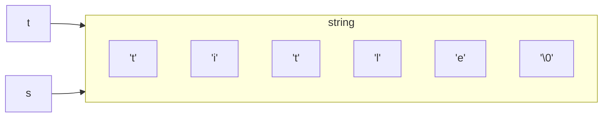
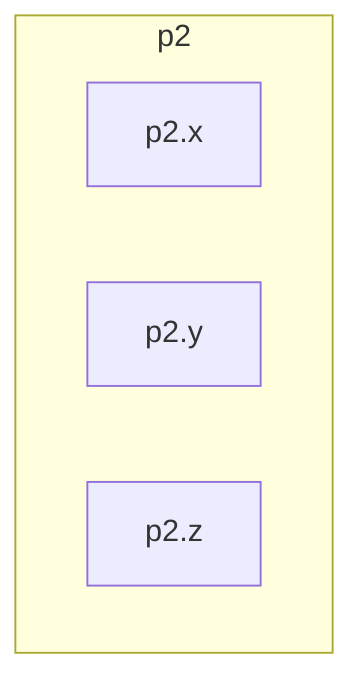
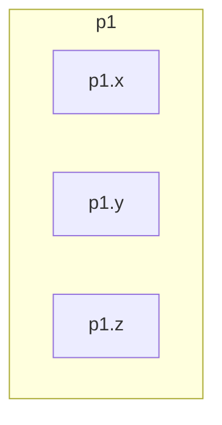

# 翁恺C语言


## 计算

> 2022.7.29
>
> 回归C语言的学习，先易后难，从最简单的计算搞起，顺便解决一些残留问题
>
> > 例如运算符优先级。

> 当然，过于简单的内容我就没耐心记录了。

### 表达式

#### 运算符优先级

##### 不用括号的单目取负

| 优先级 | 运算符 | 运算     | 结合关系 | 举例   |
| ------ | ------ | -------- | -------- | ------ |
| 1      | +      | 单目不变 | `<--`    | `a*+b` |
| 1      | -      | 单目取负 | `<--`    | `a*-b` |
| 2      | *      | 乘       | `-->`    | `a*b`  |
| 2      | /      | 除       | `-->`    | `a/b`  |
| 2      | %      | 取余     | `-->`    | `a%b`  |
| 3      | +      | 加       | `-->`    | `a+b`  |
| 3      | -      | 减       | `-->`    | `a-b`  |
| 4      | =      | 赋值     | `<--`    | `a=b`  |

单目运算符最让我感兴趣，是不是都不用加括号了？

> 单目➕和➖的结合关系是从右到左⬅️，这就暗示不需加括号了。

```c
#include <stdio.h>
int main()
{
    int a=3,b=4;
    printf("a*+b=%d\n",a*+b);
    printf("a*-b=%d\n",a*-b);
    printf("a*(-b)=%d\n",a*(-b));
    return 0;
}
```

```
a*+b=12
a*-b=-12
a*(-b)=-12

```

amazing！果然不需要括号！

---

##### 赋值是运算符，不是语句，赋值运算也有结果

这就使得连等式是存在的：

```c
#include <stdio.h>
int main()
{
    int a,b;
    a=b=6;
    printf("a=%d,b=%d",a,b);
    return 0;
}
```

```
a=6,b=6
```

其实`a=b=6;`等价于`a=(b=6);`，因为`=`是从右向左结合的。

---

开放脑洞，是否有更丑陋的表达式？

* 如果有四个变量
  * 形如`a=b=6=c=3=d=4;`显然是不行的，因为从右向左看，`3=d=4;`就是在给常数3赋值，很荒谬
    * 因此，涉及很多个变量的连等式，中间不能出现数字，连等式的威力很小，只能把很多个变量赋相同的值

```c
#include <stdio.h>
int main()
{
    int a,b,c,d;
    a=b=c=d=114514;
    printf("a=%d,b=%d,c=%d,d=%d",a,b,c,d);
    return 0;
}
```

```
a=114514,b=114514,c=114514,d=114514
```

但是有一种“嵌入式赋值”，想象力很丰富：

```c
#include <stdio.h>
int main()
{
    int a,b,c,d;
    a=114;
    c=1405+(b=514);
    printf("a=%d,b=%d,c=%d",a,b,c);
    return 0;
}
```

```
a=114,b=514,c=1919
```

虽然不被推崇，但是低水平的考试会考，真烦人。

不过这种式子还是让人耳目一新的。

> ⚠️`c=1405+(b=514);`中的括号不能删去，因为➕的优先级比🟰高，所以不加括号会让计算机无所适从。


##### 复合赋值和递增递减赋值

###### 复合赋值定义

复合赋值就是五个算术运算符和赋值运算符结合起来。

```
+= -= *= /= %=
```

---

> 这里翁恺老师说了一句很有意思的话：“注意两个运算符之间不能有空格，否则就是另外的意思了。”
>
> 还有另外的意思？

可是我打出`a + = 514;`，CLion却给我报错了，说明这只是一个错误的说法，翁恺老师不严谨，让我白忙活。


###### 递增递减赋值定义与特点

递增递减赋值是单目运算符`++` `--`，只能对**变量**操作。

`a++`和`++a`是有区别的：

```c
#include <stdio.h>
int main()
{
    int a,b,c,d;
    a=114;
    a=a++;
    printf("a=%d",a);
    return 0;
}
```

```
a=114
```

体现出`a++`在当前步骤并没有使a的值发生改变。

```c
#include <stdio.h>
int main()
{
    int a,b,c,d;
    a=114;
    a=++a;
    printf("a=%d",a);
    return 0;
}
```

```
a=115
```

体现出`++a`在当前步骤已经使a的值发生改变。


###### 结合关系

> 不必纠结，大多数都是➡️，只有三种例外。

* 一般是➡️
* 只有单目➕➖和赋值🟰是⬅️

此处翁恺老师举了一个巨丑的式子`a=(a=a*2)*6*(a=a+3);`为例：

```c
#include <stdio.h>
int main()
{
    int a,b,c,d;
    scanf("%d",&a);
    a=(a=a*2)*6*(a=a+3);
    printf("a=%d",a);
    return 0;
}
```

最左边的、最重要的🟰的右边部分整体上是➡️，括号内再具体判断。

```
1
a=60
```

```
2
a=168
```

```
3
a=324
```

根据我的判断，巨丑式子`a=(a=a*2)*6*(a=a+3);`可以用`a=2*a*6*(2*a+3);`代替，即`a=12*a(2*a+3);`,从结果来看确实没错。

显然还是代替式更合理，不容易出错。


###### 在丑陋表达式中使用复合赋值与递增递减复制，看看是否有区别

> 研究这个是因为我记得研究指针的时候，有时复合赋值会出问题，说明复合赋值和单纯的赋值还是有区别的。要严谨，要深挖到底有什么不同。

```c
#include <stdio.h>
int main()
{
    int a,b,c,d;
    a=114;
    a=a+=1919;
    printf("a=%d",a);
    return 0;
}
```

```
a=2033
```

这里没问题，`a=a+=1919;`等价于`a=a=a+1919;`

```c
#include <stdio.h>
int main()
{
    int a,b,c,d;
    scanf("%d",&d);
    a=d;
    a=(a=a*2)*6*(a=a+3);
    b=d;
    b=(b*=2)*6*(b+=3);
    printf("a=%d\nb=%d",a,b);
    return 0;
}
```

```
2
a=168
b=168
```

`a=(a=a*2)*6*(a=a+3);`等价于`a=(a*=2)*6*(a+=3)`

没找到茬，是我脑洞不够大？

来看看翁恺老师提出的超复杂的表达式：

```c
a = b+=c++-d+--e/-f
```

化简得：`a=b+c-d+(e-1)/f`

> 严格来说，我的等价只考虑了要输出的那个变量，因此是不完整的。
>
> 详细的等价：
>
> ```c
> a = b+=c++-d+--e/-f
> ```
>
> 可拆分为
>
> ```c
> a=b+c-d+(e-1)/(-f);
> b=b+a;
> e=e-1;
> c=c+1;
> ```

```c
#include <stdio.h>
int main()
{
    int a,b,c,d,e,f,a1,b1,c1,d1,e1,f1;
    a = b+=c++-d+--e/-f;
    b1=b,c1=c,d1=d,e1=e,f1=f;
    a1=b1+c1-d1+(e1-1)/-f1;
    if (a1==a) printf("a1=a");
    else printf("a1≠a");
    return 0;
}
```

```c
a1≠a
```

这个结果是让我失望的，我以为会`a1=a`

但是我在认识到`我的等价只考虑了要输出的那个变量，因此是不完整的。`后，我发现`b1=b,c1=c,d1=d,e1=e,f1=f;`应该上移。

最后果然`a1=a`。

> 我之前一直认为，杂糅的表达式吃力不讨好，那时因为`我的等价只考虑了要输出的那个变量，因此是不完整的。`，现在我发现杂糅的表达式能把很多式子放在一行内解决。还是有优点的。
>
> 但是我绝对不会用这种式子，自己容易看错，还给别人增加理解负担。


---

###### 复合赋值是很贴近底层的

PDP-11标准里面也有`+=` `-=`的指令，所以能直接被机器读懂。C语言是贴近底层的语言。


## 判断和循环

主要是一些细节需要温故。

### 逻辑类型和运算

#### 逻辑类型

##### 头文件`<stdbool.h>`是必要的

我之前学习的时候只听不留笔记，结果就是后来用`bool`类型的时候不记得还有这个头文件。

##### `bool`类型变量的本质和输出

`bool`类型本质上还是`int`，所以输出时还是用`%d`。

```c
#include <stdio.h>
#include <stdbool.h>
int main()
{
    bool b = 6>5;
    if (b==1&&b==true) printf("b = true = 1\n");
    bool t = 2;
    printf("t = %d, bool is not just 1 or 0, ture or false",t);
    return 0;
}
```

```
b = true = 1
t = 1, bool is not just 1 or 0, ture or false
```

如果t是非零值，那么t的值都是1。这有趣，和while、for循环条件呼应，括号里只要是非零值就可以继续。


#### 逻辑运算

##### 逻辑运算的种类

| 逻辑与 | &&   |
| ------ | ---- |
| 逻辑或 | \|\| |
| 逻辑非 | !    |

```c
#include <stdio.h>
#include <stdbool.h>
int main()
{
    bool a= 6>5 && 7>5;//用int也是一样的效果
    int b= 6>5 || 7>5;
    bool c= 6<5 && 7>5;
    bool d= !1;
    bool e= !2;
    printf("a=%d\tb=%d\tc=%d\td=%d\te=%d\t",a,b,c,d,e);
    return 0;
}
```

```
a=1	b=1	c=0	d=0	e=0	
```

有几点发现：

* `bool`和`int`在大多数情况下都可以通用，`bool`多出的功能仅仅是可以对变量赋值`true `和`false`
* 从CLion的代码变灰看来，如果做与、或运算的时候从前面就可以判断出结果是1或0，那么后面就不会执行，节约计算量
  * 这叫做“短路”
    * 对于`&&`,左边是`false`就不会做右边的计算了
      * 即便是`a==1 && b+=1`这种右边不是判断而是真的计算的时候，也不会算`b+=1`。
      * 所以，不要把赋值和复合赋值组合进该类表达式
    * 对于`||`,左边是`true`就不会做右边的计算了
* 逻辑非也可以对常量进行运算
  * 只能对变量运算的是递增递减运算


##### 运算符优先级

从直觉来看，`!`的优先级应该最高，它是单目的，它的优先级高才能使得`b= !1 && !0`这样的式子容易理解。

但是`&&`和`||`也有优先级之分。总的来说，`!`>`&&`>`||`。

| 优先级 | 运算符            | 结合性 |
| ------ | ----------------- | ------ |
| 1      | `()`              | ➡️      |
| 2      | 单目`! + - ++ --` | ⬅️      |
| 3      | `* / %`           | ➡️      |
| 4      | `+ -`             | ➡️      |
| 5      | `< <= >= >`       | ➡️      |
| 6      | `== !=`           | ➡️      |
| 7      | `&&`              | ➡️      |
| 8      | `||`              | ➡️      |
| 9      | `= += -= /= %=`   | ⬅️      |

所以看`!a<20`这个式子，它并不等价于`a>=20`，后者等价于`!(a>20)`

* 若`a≠0`
  * 则`!a=1`
* 若`a=0`
  * 则`!a=0`

###### `< <= >= >`比  `== !=`优先的原因

看这个式子`if (1>2 != 0)`，直觉就是先判断`1>2`的正误。

##### 逻辑运算的好处

最大的好处就是简化判断语句，可以少嵌套几个`if-else`。

当然这种情况好像就不能少嵌套：

```c
#include <stdio.h>
int main()
{
    int a=0,b=1;
    if (a==0) {
        if (b==2) {
            printf("a==0 && b==2");
        }else {
            printf("a==0 && b!=2");
        }
    }
    return 0;
}
```


#### 条件运算和逗号运算

##### 条件运算

```c
a=(a>20)?a-10:a+10;
```

相当于：

```c
    if (a>20) {
        a=a-10;
    }else {
        a=a+10;
    }
```

条件运算在简单情况下确实能简化代码，但在复杂情况下会让代码变得更复杂、难以理解。

例如`x = a++>=1 && b-->2 ? a:b ` `x=3*a>5 ? 5:20` 

如果还出现了嵌套条件表达式，那就更麻烦了：

```c
a=(c>20)?(c>15)?c-10:c-5:(c<10)?c+10:c+5;
```

我的直觉：条件运算缺乏“封装”的美感，我不会在自己在乎的项目上用。

万一遇到杂种题目，牢记以下原则：

1. 条件运算优先级仅仅高于赋值运算，低于其他运算符

2. 条件运算符⬅️结合

   ```c
   w<x?x+w:x<y?x:y
   ```

真是屎山必备代码！！！


##### 逗号运算

###### 最低的优先级

逗号的运算符是最低的，甚至比赋值运算符还要低。

> [C语言运算符优先级 (biancheng.net)](http://c.biancheng.net/view/285.html)
>
> | 优先级 | 运算符                                                       | 结合律   |
> | ------ | ------------------------------------------------------------ | -------- |
> | 1      | 后缀运算符：[]   ()   ·   ->   ++   --(类型名称){列表}       | 从左到右 |
> | 2      | 一元运算符：++   --   !   ~   +   -   *   &   sizeof_Alignof | 从右到左 |
> | 3      | 类型转换运算符：(类型名称)                                   | 从右到左 |
> | 4      | 乘除法运算符：*   /   %                                      | 从左到右 |
> | 5      | 加减法运算符：+   -                                          | 从左到右 |
> | 6      | 移位运算符：<<   >>                                          | 从左到右 |
> | 7      | 关系运算符：<<=   >>=                                        | 从左到右 |
> | 8      | 相等运算符：==   !=                                          | 从左到右 |
> | 9      | 位运算符 AND：&                                              | 从左到右 |
> | 10     | 位运算符 XOR：^                                              | 从左到右 |
> | 11     | 位运算符 OR：\|                                              | 从左到右 |
> | 12     | 逻辑运算符 AND：&&                                           | 从左到右 |
> | 13     | 逻辑运算符 OR：\|\|                                          | 从左到右 |
> | 14     | 条件运算符：?:                                               | 从右到左 |
> | 15     | 赋值运算符：    =     +=     -=    *=    /=    %=    &=    ^=    \|=     <<=    >>= | 从右到左 |
> | 16     | 逗号运算符：，                                               | 从左到右 |

这就使得`int a=3+4,5+6;`并不能得到我们想要的`a=11`，而是`a=7`。

虽然逗号运算是把各个操作都执行，最后取最右边的值，但是由于逗号运算符优先级最低，所以`a= 3+4`，剩余的`5+6`虽然被执行但是无法赋值给`a`.

```c
#include <stdio.h>
int main()
{
    int a=(3+4,5+6);
    printf("a=%d",a);
    return 0;
}
```

```
a=11
```


###### 是否适用于三个及以上表达式的连接？

```c
#include <stdio.h>
int main()
{
    int a=(3+4,5+6,11+45);
    printf("a=%d",a);
    return 0;
}
```

```
a=56
```

适用！可见翁恺老师不严谨，他只提了两个表达式的情况。


###### 不可行的情况

`int a=(3+4,int b=1,12);`中有定义语句，CLion报错了！看来语句不是表达式！

```c
#include <stdio.h>
int main()
{
    int a,b;
    a=(3+4,114514,b=1919);
    printf("a=%d",a);
    return 0;
}
```

```
a=1919
```

这才是可行的。

尝试在`printf`语句中使用逗号运算符：

```c
#include <stdio.h>
int main()
{
    printf("%d",3+4,5+6);
    return 0;
}
```

```
7
```

看来加上括号是个好习惯：

```c
#include <stdio.h>
int main()
{
    printf("%d",(3+4,5+6));
    return 0;
}
```

```
11
```


###### 应用场景

在`for `循环的条件里用的最多：`for (i=1,j=10;i<j;i++,j++)`

我以后遇到给很多变量赋值会考虑`a=1,b=2,c=3;`节约行数，运用逗号运算“所有表达式都会被执行”的好处。


###### 自洽性

我之前就吐槽过指针的`*`在定义和使用中不自洽，但是逗号运算的自洽性让我惊喜！

`int a=11,b=45,c=14`就可以当作逗号运算来理解。


## 指针入门

> 要不是在学习过程中遇到障碍我也不会尝试用markdown记笔记。
>
> 主要是因为之前对指针的魅力不了解、学习任务不够紧迫，所以指针的学习困在这里一拖再拖。经常隔一段时间之后再回来就会看不太懂上课的源代码，这极大地增大了我的学习难度。
>
> 显然我需要一个笔记帮助我整理知识点，否则无法把翁恺老师的视频总结出来，也无法把我亲手写的源代码串联。
>
> 源代码就写在markdown的代码块里。
>
> 以后的引用里既有引用别人的成果，也会有我自己的内心独白。　　　　


### 取地址运算

#### 初探内存

##### 用`sizeof`函数查看字节数

* `sizeof`既可以看变量的字节数
  * `sizeof(a)`
  * `sizeof(i)`
* `sizeof`又可以直接查看变量类型的字节数
  * `sizeof(int)`
  * `sizeof(double)`

> 如果有洞察力，就可以在这里看出指针的逻辑了：因为类型的字节数固定，所以知道了第一个地址就可以知道整个变量占据了哪些空间。

有趣的是，`sizeof`的返回值竟然是长整型，输出的时候要用`%ld`.

```c
#include <stdio.h>
int main()
{
    int a = 6;
    printf("sizeof(int)=%ld\n", sizeof(int));
    printf("sizeof(double)=%ld\n", sizeof(double));
    printf("sizeof(const int)=%ld\n", sizeof(const int));
    printf("sizeof(float)=%ld\n", sizeof(float));
    printf("sizeof(char)=%ld\n", sizeof(char));

    printf("sizeof(a)=%ld\n", sizeof(a));

    return 0;
}
```

```
sizeof(int)=4
sizeof(double)=8
sizeof(const int)=4
sizeof(float)=4
sizeof(char)=1
sizeof(a)=4
```

##### 用运算符&看变量地址

```c
#include <stdio.h>
int main()
{
    int i = 0;
    printf("0x%x\n", &i);//warning:format specifies type 'unsigned int' but the argument has type 'int *' [-Wformat]
    printf("%p\n", &i);
    return 0;
}
```

```
1 warning generated.
0x6fb8f338
0x16fb8f338
```

%p是输出地址，&x是输出16进制整数。

`0x16fb8f338`比`0x6fb8f338`多出`1`是因为计算机架构的问题。用32位架构就完全相同，我的MacBook Air M1 运行64位的win11虚拟机没问题，所以我的电脑应该不是32位。

###### &只能对变量取地址

&(a++),&(a+b)都是不合法的

###### 用&初窥C语言的"堆栈(stack)"内存分配

```c
#include <stdio.h>
int main()
{
    int i = 0;
    int j;
    printf("&i=%p\n", &i);
    printf("&j=%p\n", &j);
    return 0;
}

```

| 变量 | 地址        |
| ---- | ----------- |
| i    | 0x16fdab318 |
| j    | 0x16fdab314 |

> 这是某一次运行的结果

再运行一次，后三位和前四位都没变，就中间变了

| 变量 | 地址        |
| ---- | ----------- |
| i    | 0x16b95f318 |
| j    | 0x16b95f314 |

这个内存分配模式真有趣，为什么后面的318和314总是不变呢？

多试了几次后发现，如果换成i和p，就变成308和304了，经过这一操作后再换回i和j，还是318和314。看来换了变量名就会有改变，但是我又试了a和j，结果还是318和314。真是猜不透。

> 后来再尝试运行这段代码，得到：
>
> ```
> &i=0x304df56e8
> &j=0x304df56e4
> ```
>
> 看来末尾数字可能重新打开一次CLion就会改变，不过“堆栈”的特色是不会变的。

总之，C语言的地址分配是自顶向下的，这就是堆栈stack。

###### 数组地址间的关系

```c
#include <stdio.h>
int main()
{
    int a[10];
    printf("%p\n", &a);
    printf("%p\n", a);
    printf("%p\n", &a[0]);
    printf("%p\n", a[0]);//Warning:Format specifies type 'void *' but the argument has type 'int'
    printf("%p\n", &a[1]);
    return 0;
}
```

```
Warning:Format specifies type 'void *' but the argument has type 'int'
0x304dd66c0
0x304dd66c0
0x304dd66c0
0x5beee0
0x304dd66c4
```

`a[0]`已经存储值了，和抽象的`a`不一样，所以取`a[0]`地址就得用`&`了。

* 疑惑
  * 最让人费解的是`printf("%p\n", a);`a竟然可以当地址，这里也许“指"的含义可以初见端倪
  * 从stack的性质来看，下标越小，越靠后定义，也就是说最后的a[10]是最先定义的

> 很有道理，如果计算机先从a[0]开始，那么后面每定义一个就得检查一次有没有越界，而从a[10]开始就可以高枕无忧.


### 指针有什么用

> 这是第二个视频开始的问题，当初听的时候不做笔记就没捕捉到，导致我一直不知道指针的用处，把它当成了学字符串前的无聊的障碍。

就以scanf 为例，传进去地址可以帮我们的函数调用外面的变量。

#### 指针的定义

指针就是保存地址的变量

```c
#include <stdio.h>
int main()
{
    int i = 0;
    int *p = &i; // p储存i的地址——p指向i
    int *p1, q1;//p1是指针，q1是整数
    int p2, *q2;//p2是整数，q2是指针
    int* p3, q3;//注意，这里仍然只有p3是指针，因为int*并不是一个类型
    return 0;
}

```

> 此时初学者有一个问题是必须要思考的：鸡从鸡蛋来，鸡蛋从哪来？指针变量需要有其他的容器来存放指针变量的地址吗？
>
> 多看看帖子就明白了，最好再看《C与指针》

##### 作为参数的指针

在函数里面可以通过指针访问外面的变量，可以称作"指向"外面的变量。

```c
#include <stdio.h>
void f(int *p)
{
    printf("%p这个地址已经传到函数里面了\n", p);  
}
int main()
{
    int i = 0;
    printf("&i=%p\n", &i);
    f(&i);
    return 0;
}
```

```
&i=0x16f0c3348
0x16f0c3348这个地址已经传到函数里面了
```

##### 简直手眼通天

f函数已经获得了访问外面变量i的能力了，那么何为访问？

* 读
  * 把`*`用作单目运算符，用来求指针变量所指向的变量的值，例如`int k = *p;`则k就得到了i的值
* 写
  * 当`*p = k + 1;`时，i的值就变成了k+1

下面我们目睹一段体现指针实力的代码

```c
#include <stdio.h>
void f(int *p)
{
    printf("%p这个地址已经传到函数里面了\n", p);
    printf("因此我可以知道i的值%d,因为*p可以取变量值\n", *p);
    printf("甚至还可以做更邪恶的事情：篡改i的值\n");
    *p += 1;
}
int main()
{
    int i = 0;
    printf("&i=%p\n", &i);
    f(&i);
    printf("被篡改后的i=%d", i);
    return 0;
}

```

```
&i=0x16f32b348
0x16f32b348这个地址已经传到函数里面了
因此我可以知道i的值0,因为*p可以取变量值
甚至还可以做更邪恶的事情：篡改i的值
被篡改后的i=1
```

太邪恶了，我喜欢😍。

> 不过这里有一点不自洽，让我这个物理背景的人不是很能接受。
>
> 我们在定义一个指针变量时 `int *p = &i;`这意味着p是指针变量，p这个变量存储的值是i的地址&i,但是在后面的 `k = *p;`中，`*p`代表i的值，这从数学层面不自洽，很让人嫌弃。
>
> 只能将就着记住 `int *p = &i;`里的 `*`仅仅是一个代表属性的符号。


### 指针与数组

#### 传进函数的 `(int a[])`真的是数组吗

> 翁恺老师一开始用的例子太过复杂，我打算用一个简单的例子来证明传进去的参数不是数组而是指针。

```c
#include <stdio.h>
void explore(int a[])
{
    printf("在explore函数里sizeof(a)=%lu\n", sizeof(a));
}
int main()
{
    int a[] = {0, 1, 2, 3, 4, 5, 6, 7, 8, 9};
    printf("在main函数里sizeof(a)=%lu\n", sizeof(a));
    explore(a);
    return 0;
}
```


```
1 warning generated.
在main函数里sizeof(a)=40
在explore函数里sizeof(a)=8
```

```
warning: sizeof on array function parameter will return size of 'int *' instead of 'int []' [-Wsizeof-array-argument]
```

可见传进函数的只有指针，不是整个数组，这是可以理解的，毕竟它有顺序，所以只要一个指针指向外面的其他元素就行了。

> 不过 `sizeof(a)=8`而不是4，可能和架构有关，32位架构下就是4。

* 函数参数表中的数组其实就是指针，以下两种写法都是等价的
  * `int sum(int *ar)`
  * `int sum(int ar[])`
  * 但是`int sum(int ar)`是不对的，计算机会把`ar`当作一个变量而不是数组；`int sum(int [])`也不对，没这种写法

> 怪不得当初自己写函数，想把一个长度为10的数组传进去却失败了，原来是因为我用 `int f(int ar[10])`传进去的只是 `ar[10]`这个值罢了，不是传的整个数组。
>
> 学计算机一定要有主人翁意识，要时刻问自己“如果我想实现这个功能，我会怎么做"，那显然不会把整个数组的所有元素传进去，传一个指针就够了。


#### 数组变量是特殊的指针

* 数组变量本身表达地址

  * `int a[10];int *p=a;`无需使用&
  * `a==&a[0]`
  * 但是从`a[1]`开始的普通数组变量取地址就要用&了

* `*`运算符既可以对指针使用，也可以对数组变量使用；`[]`运算符既可以对数组使用，也可以对指针使用

  * ```c
    #include <stdio.h>
    int main()
    {
        int a[] = {22, 3, 5, 2345, 435, 3, 65};
        int *p = a;
        printf("%d\n", p[2]);
        printf("%d\n", *a);//这里只能是*a,连*a[0]都会报错。
        return 0;
    }
    ```

* 数组变量是const的指针，所以不能整体赋值，`int a[]={2,234,567,34};int b[]=a;`就是错的。`int a[];`与 `int * const a=...`是等价的。


##### 一个dalao关于数组变量是特殊的指针的证明

先说结论：数组`a`和`* const p`是同一类型的指针。

以下代码报错，说明a和p都不能修改指向的地址。

`int a[5]; int * const p; a++; p++;`

以下代码编译通过，并且输出结果正确，说明可以更改指向的地址所存的内容:

```c
#include <stdio.h>
int main() {
    int a[5];
    int * const p = a[0];
    a[0] = 0;
    (*a)++;
    printf("%p\n",a);
    printf("%d\n",*a);
    (*p)++;
    printf("%p\n",p);
    printf("%d\n",*p);
    return 0;
}
```

```
0x3053146d0
1

```

以下代码编译产生两处警告相同，均进行了强制类型转换，运行输出结果相同:

```cpp
int a[5];
int b[5];
int c;
int * const p = &a[0];

c = a;    //[Warning] assignment makes integer from pointer without a cast 
printf("%d\n", c); 
printf("%p\n", c);

c = p;    //[Warning] assignment makes integer from pointer without a cast 
printf("%d\n", c); 
printf("%p\n", c);

```

综上所述，我认为a和* const p是同一类型的指针。

[白l枫](https://www.icourse163.org/learn/ZJU-199001?tid=1465619444#/learn/forumpersonal?uid=1145950085 "白l枫")

2021-12-3

> 原来学技术也可以用学物理的方式啊：根据实验现象提出猜想，再用实验验证。只不过物理研究的是现实世界，CS研究的是信息世界。


##### 直觉之外的玩法

> 翁恺老师的课程质量真是一言难尽，虽是全网最佳，但全靠同行衬托。他的课，除了视频内容衔接生硬之外，还有一个缺点就是不能启发别人探索。
>
> 例如“拨动指针”的玩法就没有提到，这是拓宽初学者直觉的重要一步！

```c
#include <stdio.h>
int main() {
    int a[5]={1,2,3,4,5};
    int *p=a;//起初指针p指向了数组a的头部
    printf("起初指针p指向了数组a的头部\ta[0]=p[0]=*p=%d\n",*p);
    p++;//拨动指针
    printf("拨动指针后\t指针指向a[1]\ta[1]=*p=%d\n",*p);
    printf("但是此时p[1]=a[2]=%d≠*p\t=>这就是指针拨动后，相对位置变了",p[1]);
    return 0;
}
```

```
起初指针p指向了数组a的头部	a[0]=p[0]=*p=1
拨动指针后	指针指向a[1]	a[1]=*p=2
但是此时p[1]=a[2]=3≠*p	=>这就是指针拨动后，相对位置变了
```


## 字符串入门

### 字符类型

#### char具有整数和字符的双重类型

> 先自行探索
>
> Learn ComputerScience with physical methods.

首先，我第一次知道原来char也可以是整数，所以我要验证我的直觉"char类型的数字和字符依靠ASCII码相通"。

```c
#include <stdio.h>
int main()
{
    char c = 33;
    char d = '1';
    printf("%d\n", c);
    printf("%c\n", c);//这里有个有趣的小插曲，是因为我不够了解ASCII导致的：我第一次令c=1,第二次令c=32,都是空的，弄的我以为c的数值不是ascii码。
    printf("%d\n", d);
    //目前为止可以初步证明char类型以ASCII码存在于计算机中
    printf("\101 \x42 C\n");//这是在zgs的课上学到的。
    printf("\101 \102 C\n");
    printf("\101 \x42 \103\n");
    //到这可以初步证明 \ 后面的数字是八进制的，而且与字母对应
    printf("\101 \x41 C\n");//猜多加的x代表16进制
  
    return 0;
}
```

```
33
!
49
A B C
A B C
A B C
A A C

```

那么我现在的问题是，char是不是也可以是像数组变量那样“自己也能表达地址"？毕竟char的数值与ASCII码一一对应，计算机里应该有固定的区域存储这些字符。

不对！如果由char变量的值就判断出它的地址，那么数值相等的char变量岂不是都放在同一地址！？这不可能。再联想变量，变量值是数字，难道相同数字的变量都放在一个地址嘛？太荒谬了。

##### 整数和字符就是可以相等的

```c
#include <stdio.h>
int main()
{
    if (49 == '1')
    {
        printf("整数和字符就是可以相等的\n");
    }
    return 0;
}
```


```
整数和字符就是可以相等的
```

这体现了ASCII码在计算机内部的普适性。


##### 在scanf中读取char变量不能用%d

`char`和`int`终究是两个类型，不能用%d来读取char字符。

```c
#include <stdio.h>
int main()
{
    char c;
    scanf("%d",&c);
    return 0;
}
```

```
warning:
Format specifies type 'int *' but the argument has type 'char *'
```

实在要读取一个整数再输出ascii码中对应的字符，只能曲线救国——读入一个`int`，然后再赋值给`char`。


#### char类型读取空格的有趣方式

> 翁老师从混合输入出发给我们引入`输入控制流`。当然他并没有提这个名词。

##### `%d %c`与`%d%c`的区别

我们发现加不加空格是有区别的。

如果`%d %c `：

```c
#include <stdio.h>
int main()
{
    char c;
    int i;
    scanf("%d %c",&i,&c);
    printf("i=%d,c=%d,c='%c'",i,c,c);
    return 0;
}
```

```
12 1
i=12,c=49,c='1'
```

```
12a
i=12,c=97,c='a'
```

```
12             a
i=12,c=97,c='a'
```

```
   12    a
i=12,c=97,c='a'
```

```
12
1
i=12,c=49,c='1'
```

```
12


a
i=12,c=97,c='a'
```

一开始乖乖地在数字和字符间输入空格，后来发现空格可以尊重也可以无视。%d和%c之间可以是（多个）空格、（多个）回车。


如果`%d%c`:

```c
#include <stdio.h>
int main()
{
    char c;
    int i;
    scanf("%d%c",&i,&c);
    printf("i=%d\nc=%d\nc='%c'",i,c,c);
    return 0;
}
```

```
12 a
i=12
c=32
c=' '
```

```
12a
i=12
c=97
c='a'
```

```
121
i=121
c=10
c='
'
```

```
12
i=12
c=10
c='
'
```

这里就读得十分紧凑，数字读完了就读字符，所以多打的空格和回车都会被读进来。回车的ASCII码是10，空格是32。

###### `%d %c`中的空格是“负责”符号

没有空格，读完%d就不管后面了，后面随便读到什么，都算%c的。

一旦中间有了空格，那么会一直耐心地等到非空格、非回车的%c出现。

> 我猜根本原因一定是：scanf括号里的格式控制字符串中的空格根本就不是普通的字符。


### 逃逸字符

##### 引起误会，所以逃逸

不会引起误会的字符是大多数，可是当我们想输出带英文双引号的句子时，为了防止在printf里引起误会，所以要用上\

```c
#include <stdio.h>
int main()
{
    printf("I wanna say:\"引起误会，所以逃逸\"");
    return 0;
}
```

```
I wanna say:"引起误会，所以逃逸"
```

\就是声明：不要搞错了嗷，我要用逃逸字符了，不要冤枉和误解！


#### 逃逸字符概览

##### 旧式打字机残留

###### `\b`回退一格

```c
#include <stdio.h>
int main()
{
    printf("123\b456");
    return 0;
}
```

有的编译器把退格执行为删除，例如CLion：

```
12456
```

不过翁恺老师用的两个IDE都没有将其执行为删除，他的编译器是有选择性地删除：如果\b后面是一个非回车空格（翁恺老师只实验了\n）字符，那么就删除前一个再输出我们给的新的。

总之慎用吧。


###### `\t`到下一个表格位

```c
#include <stdio.h>
int main()
{
    printf("RNM\t退钱！");
    return 0;
}
```

```
RNM	退钱！
```

```c
#include <stdio.h>
int main()
{
    printf("RNM\t\t退钱！");
    return 0;
}
```

```c
RNM		退钱！
```

一般来说Tab键是4个空格，但是它不会让你单纯后退4个空格，而是让你对齐下一个位置，又称“制表位”，这里存在一个假想的表格，每格长4个单位长度。你会发现\t就是起到对齐“制表位”的效果。

> 不过我感觉这里好像只有2个单位。

再来几组体会一下：

```c
#include <stdio.h>
int main()
{
    printf("123\t\t456");
    return 0;
}
```

```
123		456
```

```c
#include <stdio.h>
int main()
{
    printf("123\t456");
    return 0;
}
```

```
123	456
```

```c
#include <stdio.h>
int main()
{
    printf("1\t456");
    return 0;
}
```

```
1	456
```

```c
#include <stdio.h>
int main()
{
    printf(".\t1\t.\t.456\t.");
    return 0;
}
```

```
.	1	.	.456	.
```

没错，确实是4个单位，只不过在typora里看上去实在短。

如果一串字符刚好有7个呢？显然，后面只会有1个空格，只要凑整Tab即可。


###### `\n`换行

这已经很熟悉了。


###### `\r`回车

回车和换行有什么区别？

```c
#include <stdio.h>
int main()
{
    printf("\rI wanna say:\"引起误会，所以逃逸\"");
    return 0;
}
```

```
I wanna say:"引起误会，所以逃逸"
```

放在开头没有任何改变。

```c
#include <stdio.h>
int main()
{
    printf("I wanna say:\"引起误会，所以逃逸\"\r");
    return 0;
}
```

放在结尾也没有作用。

```c
#include <stdio.h>
int main()
{
    printf("I wan\rna say:\"引起误会，所以逃逸\"");
    return 0;
}
```

```
na say:"引起误会，所以逃逸"
```

放在中间，把前面的弄没了。那为什么放在最后不会把整个句子弄没呢？

```c
#include <stdio.h>
int main()
{
    printf("I wann\ra say:\"引起误会，所\r以逃逸\"\r");
    return 0;
}
```

多加几个，发现只执行最右边的(默认最最右边的不执行)：

```
以逃逸"
```


##### 现代误会

`\'` `\"` `\\`可以用来打出`'` `"` `\`


### 字符串

#### 字符数组与字符串

`char word[]={'H','e','l','l','!','o'};`是字符数组，不是字符串，它不能做字符串的计算。

> 目前不知道字符串能做什么计算、为什么要做计算，感觉这是搞明白字符串存在的意义的突破口。

`char word[]={'H','e','l','l','o','!','\0'};`是字符串。

* 字符串是以0结尾的一串字符

  * 0就是'\0'，和'0'完全不一样

    > 翁恺：“0可以是int类型、long int类型，占的字节数不一定相同，但是'\0'就是只占一个字节。”
    >
    > 我很困惑，'\0'到底是什么？我纠结的是它的数据类型，计算机里不搞清楚数据类型怎么行呢？
    >
    > * 它外面有单引号，应该是字符
    > * 但是又说0就是'\0'
    >
    > 查了ASCII码就明白了，'\0'的ASCII码值就是0。

* 0标志字符串的结束，但是它不是字符串的一部分

  > 这里翁恺前后矛盾了，前面他说，`char word[]={'H','e','l','l','o','!','\0'};`有七个元素，显然把0算进去了。这里又说不是字符串的一部分，计算长度的时候不算它。
  >
  > 难道说字符数组和字符串有差别？字符数组的长度比字符串多1？

* 字符串以数组的形式存在，可以通过数组或指针访问

  * 多用指针访问

* `<string.h>`里面有很多字符串的函数


#### 字符串变量和字符串常量

##### 字符串变量

以下的定义都是对的：

* 用指针定义
  * `char *str="Hello"`
* 用数组定义
  * `char word[]="Hello"`
  * `char line[10]="Hello"`

编译器都会在存储的时候在末尾加上'\0'表示结束。

> 感觉这里初步体现出字符串和字符数组的区别。字符串真的可以如此轻松地定义，不像数组定义还要打括号和一堆单引号。

> 数组并不能用指针定义：
>
> ```c
> #include <stdio.h>
> int main()
> {
>     int *a={1,2,3,4};
>     printf("a[0]=%d\t*a=%d\n",a[0],*a);
>     a++;
>     printf("a++后,a[1]=%d\t*a=%d",a[1],*a);
>     return 0;
> }
> ```
>
> ```
> 
> ```
>
> 输出一行空白。
>
> 所以说`char *str="Hello"`的定义方式是特权吗😂


##### 字符串常量

* `"Hello"`这个字符串常量会被编译器以字符数组的形式存储，长度为6
* 两个相邻的字符串常量会被自动连接起来

```c
#include <stdio.h>
int main()
{
    //一个貌似错误的程序
    printf("两个相邻的字符串常量""会被自动连接起来!");
    return 0;
}
```

你会发现即使两组引号之间没有逗号也没关系。

还可以用\来告诉计算机字符串没有结束：

```c
#include <stdio.h>
int main()
{
    printf("两个相邻的字符串常量\会被自动连接起来!");
    return 0;
}
```

```
两个相邻的字符串常量会被自动连接起来!
```


在CLion里，加了逗号反而只能输出前半部分：

```c
#include <stdio.h>
int main()
{
    //一个貌似正确的程序
    printf("两个相邻的字符串常量","会被自动连接起来!");
    return 0;
}
```

```
warning:
Data argument not used by format string
两个相邻的字符串常量
```

也就是说，一个printf中只能有一组`""`


### 字符串变量

#### 字符串输入输出

##### 字符串的*赋值*仅仅是指针操作

```c
#include <stdio.h>
int main()
{
    char *t="title";
    char *s;
    s=t;
    return 0;
}
```

调试后发现，`s=t;`的作用是让地址s等于地址t，这样s和t就指向了同一个字符串。

> 这在逻辑上也是自洽的，`s`和`t`本就是指针变量，`s=t;`不可能生成新字符串。

但是s没有生成一个新的字符串，生成新的字符串需要字符串函数。



##### 用`%s`搭配`scanf`和`printf`输入输出

我们关注的是读到什么时候为止

* 空格？
  * ASCII=32
* 空字符？
  * ASCII=0

这是两个不同的字符。

```c
#include <stdio.h>
int main()
{
    char word[8];
    scanf("%s",word);
    printf("%s##",word);
    return 0;
}
```

读到空格就不读了：

`Hello World!`
`Hello##`

```c
#include <stdio.h>
int main()
{
    char word[8];
    scanf("%s",word);
    word[4]=32;
    printf("%s##",word);
    return 0;
}
```

```
asdasd
asda d##
```

```c
#include <stdio.h>
int main()
{
    char word[8];
    scanf("%s",word);
    word[4]=0;
    printf("%s##",word);
    return 0;
}
```

```
asfdasf
asfd##
```

我让`word[4]`成为空格，后面的正常输入。说明空格*告诉*`scanf`不要再读了，但是`scanf`能分清空格和空字符。空格、回车和tab都能起到*告诉*的作用。

###### 用`%s`搭配`scanf`输入是不安全的

因为不知道读入的长度会不会超过字符串的最大长度。

```c
#include <stdio.h>
int main()
{
    char word[8];
    scanf("%s",word);
    printf("%s##",word);
    return 0;
}
```

```
12345678

```

尝试多次后发现，长度≥8时，无法输出。调试的时候看见这个信息：`SIGABRT (signal SIGABRT)`，意识就是越界了。

###### 补救措施：`%+number+s`

```c
#include <stdio.h>
int main()
{
    char word1[8];
    char word2[8];
    scanf("%7s",word1);
    scanf("%7s",word2);
    printf("%s##%s##",word1,word2);
    return 0;
}
```

```
12345678
1234567##8##
```

输入`12345678`之后按了一次回车就结束了。

于是我们完成了一次修补，用`%+number+s`搭配`scanf`可以用了


##### 字符指针≠字符串

定义了一个字符指针，只是获得了一个地址，至于指向哪里，纯靠运气。

```c
#include <stdio.h>
int main()
{
    char *string;
    scanf("%s",string);
    return 0;
}
```

Warning:

```
Variable 'string' is uninitialized when used here
```

需要初始化，否则就真的靠运气了。

不过我的CLion比较牛，不管我输入什么字符串都输出一行空的。

```
qw

```

```
1346473457356

```

不过，奇怪的是，即使我已经初始化了，还是输出空行：

```c
#include <stdio.h>
int main()
{
    char *string;
    string="aafaqqa";
    scanf("%s",string);
    printf("%s",string);
    return 0;
}
```

```
qwefqqe

```

```c
#include <stdio.h>
int main()
{
    char *string=NULL;
    scanf("%s",string);
    printf("%s",string);
    return 0;
}
```

```
adsf

```

`char *string=NULL;`也不行。


这样的初始化也不行：

```c
#include <stdio.h>
int main()
{
    char *string="hahaha";
    scanf("%s",string);
    printf("%s",string);
    return 0;
}
```

看来是真的不能用字符指针。

> 当然不必担心。字符指针定义后只是不能再`scanf`而已，正常输出是没问题的：
>
> ```c
> #include <stdio.h>
> int main()
> {
>     char *string="The boy next door♂";
>     printf("%s",string);
>     return 0;
> }
> ```
>
> ```
> The boy next door♂
> ```

还是数组靠谱：

```c
#include <stdio.h>
int main()
{
    char string[100];
    scanf("%s",string);
    printf("%s",string);
    return 0;
}
```

```
nishiyigeyige
nishiyigeyige
```


##### 空字符串

```c
#include <stdio.h>
int main()
{
    char string[100]="";
    printf("%s",string);
    return 0;
}
```

`char string[100]="";`创造了一个空字符串,`string[0]='\0'`。

我们检验是不是除了`string[0]`以外的其他元素都空or没被赋值。

```c
#include <stdio.h>
int main()
{
    char string[100]="";
    int i;
    for (i=0;i<5;i++) {
        printf("string[%d]=%s\n",i,string[i]);
    }
    return 0;
}
```

```
string[0]=(null)
string[1]=(null)
string[2]=(null)
string[3]=(null)
string[4]=(null)

```

其实还有一则warning：

```
Format specifies type 'char *' but the argument has type 'char'
```


`(null)`可能是CLion提供的很贴心的写法，我们直接看ASCII码：

```c
#include <stdio.h>
int main()
{
    char string[100]="";
    int i;
    for (i=0;i<5;i++) {
        printf("string[%d]=%d\n",i,string[i]);
    }
    return 0;
}
```

```
string[0]=0
string[1]=0
string[2]=0
string[3]=0
string[4]=0

```

全是0，这就是空字符串。`string[100]`这个空字符串里面有100个`'\0'`字符。

* 第一个是空字符
* 后面的也不是乱赋值，也都变成了空字符


形成对比的是，如果不声明字符串的长度，如`char string[]="";`，那么计算机会让这个字符串的长度为1，即只有一个空字符，大概率是为了节约存储空间。


#### 字符串函数

要用的头文件`<string.h>`

##### `strlen`

```c
#include <stdio.h>
#include <string.h>
int main()
{
    char line[]="Hello";
    printf("strlen(line)=%ld\n", strlen(line));
    printf("sizeof(line)=%ld", sizeof(line));
    return 0;
}
```

```
strlen(line)=5
sizeof(line)=6
```

注意到`%lu`和`%ld`都可以。

`sizeof`是对整个字符数组的，包括了最后的`\0`。`strlen`就是真的字符串特有的函数了，没有考虑`\0`。


##### `strcmp`

我们想比较两个字符串是否相等，可惜`if (s1==s2) {...}`这个功能是没有的，因为他们本质上都是数组，地址是不一样的，所以`s1==s2`始终返回0。

因祸得福的是，我们有一个更强大的函数，不光能判断两个字符串是否相等，还能比较大小。

> ~~至于*比较大小*的规则，我觉得是比较字符串所有元素ASCII码之和。~~

```c
#include <stdio.h>
#include <string.h>
int main()
{
    char s1[100];
    char s2[100];//确保充足的长度。
    scanf("%s",s1);
    scanf("%s",s2);
    printf("%d", strcmp(s1,s2));
    return 0;
}
```

我们按照控制变量法来研究，先研究字符串相同的情况。

```
abc
abc
0
```

```
1234567
1234567
0
```

```
O。o___^~^
O。o___^~^
0
```

可见两个字符串完全相同时函数返回值为0。

然后再长度相同的情况下，改变一个字符：

```
abc
bbc
-1
```

a的ASCII码值比b少1。

```
abc
abd
-1
```

```
113
123
-1
```

```
213
113
1
```

```
333
133
2
```

到这里还是非常符合直觉的：整个字符串ASCII码之和的差值就是`strcmp`函数的值。

但是下面就有点可怕了：

```
333
111
2
```

```
333
113
2
```

```
444
111
3
```

```
444
113
3
```

似乎只和第一个元素之差有关。甚至当我改变元素个数：

```
444
111111
3
```

```
4
1113
3
```

```
ad
fffff
-5
```

初步猜测，当两个字符串内容不同时，`strcmp`的值就是两个字符串首个元素的ASCII码差值，后面的其他元素就不去管了。

如果第一个字符相同呢，就顺次比较后面的：

```
C#
C++
-8
```

'#'=35,'+'=43——所以-8是第二顺位之差

当计算机把每一位都比较完之后，如果都相等，那么`strcmp`就是0了。

如果前几项一直都相同，但是最后有一个字符串多处来几项：

```
rnm
rnmtuiqian
-116
```

为了验证116是不是tuiqian的ASCII之和，我亲自验算：

> 1a	2b	3c	4d	5e	6f	7g	8h	9i	10j	11k	12l	13m	14n	15o	16p	17q	18r	19s	20t	21u	22v	23w	24x	25y	26z	
>
> tuiqian=96+(20+21+9+17+9+1+14)≠116
>
> 但容易看出116=96+20，没错，就是t的ASCII码值！所以计算机还是像我预料的一样喜欢省力。

也就是说，最后如果出幺蛾子，也只用管第一个幺蛾子。

可以理解成'\0'和第一个幺蛾子元素之差，就是它自身的相反数。

是否可以用一个程序优雅地、系统地证明、展示我的推理？

```c
#include <stdio.h>
#include <string.h>
int main()
{
    char s1[101];
    char s2[101];//确保充足的长度。
    printf("我推理出strcmp函数的原理了：\n从第一个元素开始逐一比对，一旦出现不同就计算第一组异项的ASCII码之差，作为strcmp函数的返回值。\n");
    printf("please input 2 strings(length≤100):\n");
    scanf("%s",s1);
    scanf("%s",s2);
    printf("strcmp(s1,s2)=%d\n", strcmp(s1,s2));
    printf("下面让我们细致分析:\n");
    int i=0;
    while (s1[i]==s2[i]) {
        printf("%c和%c相同，s1[%d]-s2[%d]=0\n",s1[i],s2[i],i,i);
        i++;
    }
    printf("\n终于出现一个不一样的了！s1[%d]-s2[%d]=%d-%d=%d,恰好就是strcmp(s1,s2)的值%d,说明计算机发现一个不一样的就停止了",i,i,s1[i],s2[i],s1[i]-s2[i],strcmp(s1,s2));
    return 0;
}
```

```
我推理出strcmp函数的原理了：
从第一个元素开始逐一比对，一旦出现不同就计算第一组异项的ASCII码之差，作为strcmp函数的返回值。
please input 2 strings(length≤100):
114514
1145141919810
strcmp(s1,s2)=-49
下面让我们细致分析:
1和1相同，s1[0]-s2[0]=0
1和1相同，s1[1]-s2[1]=0
4和4相同，s1[2]-s2[2]=0
5和5相同，s1[3]-s2[3]=0
1和1相同，s1[4]-s2[4]=0
4和4相同，s1[5]-s2[5]=0

终于出现一个不一样的了！s1[6]-s2[6]=0-49=-49,恰好就是strcmp(s1,s2)的值-49,说明计算机发现一个不一样的就停止了
```


##### `strcpy`

```c
#include <stdio.h>
#include <string.h>
int main()
{
    char s1[101];
    char s2[101];//确保充足的长度。
    printf("please input 2 strings(length≤100):\n");
    scanf("%s",s1);
    scanf("%s",s2);
    printf("strcpy(s1,s2)根本就不是copy and paste,而是残忍的替换：\n");
    strcpy(s1,s2);
    printf("s1=%s,已经被替换成s2了。",s1);
    return 0;
}
```

```
please input 2 strings(length≤100):
苏维埃社会主义
苏修叛徒集团+社会帝国主义
strcpy(s1,s2)根本就不是copy and paste,而是残忍的替换：
s1=苏修叛徒集团+社会帝国主义,已经被替换成s2了。
```

有趣的是，即使s1更短也能被强行替换成s2，不用担心什么越界的问题。——毕竟'\0'也是一个元素，是可以被替换的，只要定义时给出的存储空间够用就行了。

那么如果真的连存储空间都不够呢？是否还能替换？比如我们用上`char s1[]="0";`这样s1的长度就只有1。

```c
#include <stdio.h>
#include <string.h>
int main()
{
    char s1[]="0";
    char s2[101];//确保充足的长度。
    printf("please input s2(length≤100):\n");
    //scanf("%s",s1);
    scanf("%s",s2);
    printf("strcpy(s1,s2)根本就不是copy and paste,而是残忍的替换：\n");
    strcpy(s1,s2);
    printf("s1=%s,已经被替换成s2了。",s1);
    return 0;
}
```

```
1324125
strcpy(s1,s2)根本就不是copy and paste,而是残忍的替换：

```

果然爆掉了💩。甚至都无法执行最后一行输出语句。

> 突然发现翁恺老师后面就立刻讲到这个问题了！这就叫*不安全*。


##### `strcat`

cat代表连接，不是猫🐱！

`strcat(s1,s2)`让`s1`从`s1[strlen(s1)]`开始(本来是'\0'的)接上`s2`。

```c
#include <stdio.h>
#include <string.h>
int main()
{
    char s1[101];
    char s2[101];//确保充足的长度。
    printf("please input 2 strings(length≤100):\n");
    scanf("%s",s1);
    scanf("%s",s2);
    strcat(s1,s2);
    printf("strcat(s1,s2)后,s1=\"%s\"",s1);
    return 0;
}
```

```
RNM!
TuiQian!
strcat(s1,s2)后,s1="RNM!TuiQian!"
```

> `strcmp`和`strcat`都是可以自己写出来的。
>
> `strcmp`和`strcat`都是不安全的。（这两点共同点没有因果联系）


安全的版本：

* `strncat(s1,s2,n)`把s2前n位接到s1后面

```c
#include <stdio.h>
#include <string.h>
int main()
{
    char s1[101];
    char s2[101];//确保充足的长度。
    printf("please input 2 strings(length≤100):\n");
    scanf("%s",s1);
    scanf("%s",s2);
    strncat(s1,s2,3);
    printf("strcat(s1,s2,3)后,s1=\"%s\"",s1);
    return 0;
}
```

```
1234
23452346
strcat(s1,s2,3)后,s1="1234234"
```


* `strncpy(s1,s2,n)`把s2前n位覆盖到s1

```c
#include <stdio.h>
#include <string.h>
int main()
{
    char s1[101];
    char s2[101];//确保充足的长度。
    printf("please input 2 strings(length≤100):\n");
    scanf("%s",s1);
    scanf("%s",s2);
    strncpy(s1,s2,3);
    printf("strcpy(s1,s2,3)后,s1=\"%s\"",s1);
    return 0;
}
```

```
125345246
55555
strcpy(s1,s2,3)后,s1="555345246"
```

出乎意料！看来`strncpy`起到的作用是把s2的前n位覆盖到s1的前n位


`strcmp`也有对应的`strncmp(s1,s2,n)`，是比较前n位。这并不是为了安全。


## 结构类型

### 枚举

#### 为什么需要枚举？

1. 数字常量化的需求
   1. 用常量变量代替数字，增加程序可读性
2. `const int`比较麻烦

```c
#include <stdio.h>
int main()
{
    int color;
    char *favor=NULL;
    scanf("%d",&color);
    const int RED=1;
    const int GREEN=2;
    const int BLUE=3;
    switch (color) {
        case RED:
            favor="red";
            break;
        case GREEN:
            favor="green";
            break;
        case BLUE:
            favor="blue";
            break;
        default:
            favor="unknown";
    }
    printf("you favorite color is %s",favor);
    return 0;
}
```

```
2
you favorite color is green
```

当然`const int`的定义可以放在`main`外面。当然也可以用`#define`。

```c
#include <stdio.h>
#define RED 1
#define GREEN 2
#define BLUE 3
int main()
```

#### 枚举的定义规则

用枚举定义就方便很多

```c
#include <stdio.h>
enum COLOR {RED,GREEN,BLUE};//这是一个语句
int main()
{
    int color;
    char *favor=NULL;
    scanf("%d",&color);
    switch (color) {
        case RED:
            favor="red";
            break;
        case GREEN:
            favor="green";
            break;
        case BLUE:
            favor="blue";
            break;
        default:
            favor="unknown";
    }
    printf("you favorite color is %s",favor);
    return 0;
}
```

```
2
you favorite color is blue
```

`enum {RED,GREEN,BLUE};`也是可以的，毕竟那个COLOR只是一个标识作用。

`RED`储存了`0`这个值，`GREEN`储存了`1`这个值，依次类推。

当然，它们都是const，后续不能重新赋值。


##### 小技巧：计算长度

枚举是默认从0开始赋值,和数组很像。

`enum COLOR {RED,YELLOW,GREEN,NumberColors}`，那么NumberColors的值就是它前面的常量(我们关心的颜色)的个数。


##### 不常规的定义

也可以人为赋值

```c
enum {RED,GREEN=66,BLUE=99};
```

但是枚举赋值不能相同！这是一个缺点！

```c
enum {RED,GREEN=66,BLUE=0};
```

```c
error:
Duplicate case value: 'RED' and 'BLUE' both equal '0'
```

与其说这是缺点，不如说这个功能不为重复赋值而生。每个常量都要有所区分，才能起到一一对应的作用。

此外，枚举赋值可以不递增，例如我可以让BLUE小于GREEN：

```c
enum {RED,GREEN=66,BLUE=2};
```


#### 枚举到底是什么类型？

```c
enum COLOR {RED,GREEN,BLUE};
```

其中的COLOR，前面说可要可不要，但是最好还是要有的，因为enum可以产生一个新的、属于我自己的数据类型COLOR，这很有趣。

在函数里声明的时候也是把COLOR当一个新的数据类型(当然还是以int存储)，但是在C语言里面要和前面的enum一起用：

```c
#include <stdio.h>
enum COLOR {RED,GREEN,BLUE,PURPLE,YELLOW,C20H19N3,};//这是一个语句
void f(enum COLOR t,int n);
int main()
{
    enum COLOR c=RED;//这就是定义
    int n;
    scanf("%d",&n);
    f(c,n);
    return 0;
}
void f(enum COLOR t,int n)
{
    printf("RED后的第%d个颜色值是%d",n,t+n);
}

```

```
3
RED后的第3个颜色值是3
```

有点尴尬的是，本来想输出`RED后的第3个颜色是PURPLE`的，但是发现并不能返回常量名，可见其和数组的区别。

#### 枚举的好处总结

* 虽然枚举可以当成一个新的类型，但并不好用
* 排比定义比`const int `方便，比`#define`好用
  * 比`const int`也仅仅好在默认从0开始定义
    * 因为`const int`如果用逗号隔开各个常量，在一行里定义，其实也不烦
  * 比`#define`好在，我们知道我们得到的是int类型


### 结构

#### 结构类型

> 说白了就是表格里的属性嘛。

```c
#include <stdio.h>
int main()
{
    struct date {
        int month;
        int day;
        int year;
    };//CLion自动帮我补齐了分号
    struct date today;//定义了一个结构类型的变量today，它的内容丰富
    today.month=5;
    today.day=27;
    today.year=2022;
    printf("The date of today is %d-%d-%d in American date form",today.month,today.day,today.year);
    return 0;
}
```

```
The date of today is 5-27-2022 in American date form
```

这是结构类型的定义，可以放在函数里面，只为这个函数所用——但是我们更喜欢放在外面，能为所有函数所用。

当然，分号始终不能丢，因为这只是一个定义的语句，大括号不是变量空间。

最后输出的时候，翁恺老师用的是`%i`，这也是输出整型，不过是老式写法。

> [C语言中输入输出所有格式控制符 | Tom's develop Blog (tomsworkspace.github.io)](https://tomsworkspace.github.io/2020/01/16/C语言中输入输出所有格式控制符/)

##### 声明结构的三种方式

除了一开始我们使用的方式，还有两种比较简陋的版本。

```c
struct point{
        int x;
        int y;
    }p1,p2;
```

这种省略了后期再多打`struct point`来定义结构变量。

还有一种，我们甚至不关注结构的名字：

```c
struct {
        int x;
        int y;
    }p1,p2;
```

##### 每一个结构里的变量是如何存储的？

我感觉结构的存储和数组有相似之处。

```c
#include <stdio.h>
int main()
{
    struct t{
        int x;
        int y;
        int z;
    }p1,p2;
    printf("%p-->p1.x\t%p-->p1.y\t%p-->p1.z\n%p-->p2.x\t%p-->p2.y\t%p-->p2.z\n",p1.x,p1.y,p1.z,p2.x,p2.y,p2.z);
    return 0;
}
```

```
0x9-->p1.x	0x0-->p1.y	0x9055060-->p1.z
0x59336d0-->p2.x	0x3-->p2.y	0x100d68883-->p2.z
```

```
0x9-->p1.x	0x0-->p1.y	0x8c0c060-->p1.z
0x4ffc6d0-->p2.x	0x3-->p2.y	0x10087a883-->p2.z
```

```
0x9-->p1.x	0x0-->p1.y	0xa845060-->p1.z
0x87856d0-->p2.x	0x3-->p2.y	0x1023ca883-->p2.z
```

好奇怪啊！这个地址真是诡异。

诶，低级错误，天呐。竟然忘记加`&`了。

```
0x30c6f06c0-->p1.x	0x30c6f06c4-->p1.y	0x30c6f06c8-->p1.z
0x30c6f06b0-->p2.x	0x30c6f06b4-->p2.y	0x30c6f06b8-->p2.z
```

```
0x30d9d26c0-->p1.x	0x30d9d26c4-->p1.y	0x30d9d26c8-->p1.z
0x30d9d26b0-->p2.x	0x30d9d26b4-->p2.y	0x30d9d26b8-->p2.z
```

不难总结出





发现：

* p1 先定义，被压在堆栈下面，奇怪的是x也先定义，却被放在了上面！

* p1内部、p2内部地址间隔4，p2.z和p1.x隔了8

  * 有没有可能中间隔了p1或p2的地址？

    * 检验

    ```
    0x30dc346c0-->p1.x	0x30dc346c4-->p1.y	0x30dc346c8-->p1.z
    0x30dc346b0-->p2.x	0x30dc346b4-->p2.y	0x30dc346b8-->p2.z
    0x30dc346c0-->p1	0x30dc346b0-->p2
    ```

    发现中间隔的并不是p1或p2，而且`&p1==&p1.x`,`&p2==&p2.x`


##### 结构初始化

```c
#include <stdio.h>
int main()
{
    struct t{
        int x;
        int y;
        int z;
    };
    struct t p1={1,2,3};
    struct t p2={.x=666,.z=9};
    return 0;
}
```

`struct t p1={1,2,3};`是依次初始化；`struct t p2={.x=666,.z=9};`是只初始化了p2.x和p2.z，p2.y默认初始化为0，这点和数组很像的。

###### 简陋定义下的初始化

之前提到有两种简陋定义，他们怎么初始化呢？

* 错误做法

  * 亡羊补牢

    * ```c
      struct t{
              int x;
              int y;
              int z;
          }p1,p2;
          p1={1,2,3};
      ```

    * ```
      error:
      Expected expression
      ```

    * 总之，这已经不是初始化了，这是一种不合法的后期赋值

  * 重复定义

    * ```c
      struct t{
              int x;
              int y;
              int z;
          }p1,p2;
          struct t p1={1,2,3};
      ```

    * ```
      error:
      Redefinition of 'p1'
      ```

    * 这是重复定义，不合法

* 正确做法

  * ```c
    struct t{
            int x;
            int y;
            int z;
        }p1={1,2,3},p2;
    ```

  * 在简陋定义的时候就初始化


错误做法的共同点是混淆了后期赋值和初始化。那我真的想后期赋值怎么办呢？

```c
p2=(struct t){114514,1919,810};
```

`(struct t)`相当于强制类型转换。


###### 和数组的异同

* 同

  * 定义时若只初始化一个元素，那么其他的元素都默认初始化为0

    * ```c
      #include <stdio.h>
      #define N 5
      int main()
      {
          struct t{
              int x;
              int y;
              int z;
          }p1={114514},p2;
          printf("p1.x=%d\tp1.y=%d\tp1.z=%d\n",p1.x,p1.y,p1.z);
          int a[N]={1919810},i;
          for (i=0;i<N;i++) {
              printf("a[%d]=%d\t",i,a[i]);
          }
          return 0;
      }
      ```

    * ```
      p1.x=114514	p1.y=0	p1.z=0
      a[0]=1919810	a[1]=0	a[2]=0	a[3]=0	a[4]=0	
      ```

  * 定义时若没做任何初始化，那么元素里的值就是随机的，就像开盲盒

    * ```c
      #include <stdio.h>
      #define N 5
      int main()
      {
          struct t{
              int x;
              int y;
              int z;
          }p1,p2;
          printf("p1.x=%d\tp1.y=%d\tp1.z=%d\n",p1.x,p1.y,p1.z);
          int a[N],i;
          for (i=0;i<N;i++) {
              printf("a[%d]=%d\t",i,a[i]);
          }
          return 0;
      }
      ```

    * ```
      p1.x=77410000	p1.y=1	p1.z=81412112
      a[0]=226223824	a[1]=3	a[2]=81012867	a[3]=2	a[4]=9	
      ```

* 异

  * 结构有虚实之分，数组全是实实在在的

    * ```c
      struct t{
              int x;
              int y;
              int z;
          }p1,p2;
      ```

    * t是结构类型，是虚的，只可意会；p1和p2才是实在的结构变量

  * 结构可以后期整体赋值，而数组只能在初始化的时候整体赋值，后期想赋值只能遍历

  * 结构还可以相互赋值

    * `p1=p2`
      * 相当于`p1.x=p2.x,p1.y=p2.y;`

  * 数组自己就是指针，但是结构得用上&来取地址，而且指针也要是结构类型

    * ```c
      #include <stdio.h>
      #define N 5
      int main()
      {
          struct space{
              int x;
              int y;
              int z;
          }p1={114514},p2;
          struct space *p=&p1;
          printf("%p",p);
          return 0;
      }
      ```

    * ```
      0x3058046c0
      ```


##### 结构指针

我的直觉逐步合理化，主动探索结构指针，并在CLion的指引下学会对结构内部成员取地址。

###### 结构指针p的地址输出和其成员地址输出的区别

```c
#include <stdio.h>
#define N 5
int main()
{
    struct space{
        int x;
        int y;
        int z;
    }p1={114514},p2;
    struct space *p=&p1;
    printf("p=%p\tp->x=%p\tp->y=%p\tp->z=%p\n",p,p->x,p->y,p->z);
    printf("&p1=%p\t&p1.x=%p\t&p1.y=%p\t&p1.z=%p\n",&p1,&p1.x,&p1.y,&p1.z);
    return 0;
}
```

```
p=0x304ea26c0	p->x=0x1bf52	p->y=0x0	p->z=0x0
&p1=0x304ea26c0	&p1.x=0x304ea26c0	&p1.y=0x304ea26c4	&p1.z=0x304ea26c8

```

目前还有点问题。`p->y`和`p->z`显然不是地址。

16进制下的`1bf52=2+5x16+15x16^2+11x16^3+16^4=114514`，再联系`p->y=0x0	p->z=0x0`，看来输出的是`p1.x`、`p1.y`、`p1.z`的值，以16进制罢了。

所以我们换回%d，发现果然输出的是`p1.x`、`p1.y`、`p1.z`的值：

```c
#include <stdio.h>
#define N 5
int main()
{
    struct space{
        int x;
        int y;
        int z;
    }p1={114514},p2;
    struct space *p=&p1;
    printf("p=%p\tp->x=%d\tp->y=%d\tp->z=%d\n",p,p->x,p->y,p->z);
    printf("&p1=%p\t&p1.x=%p\t&p1.y=%p\t&p1.z=%p\n",&p1,&p1.x,&p1.y,&p1.z);
    return 0;
}
```

```
p=0x3053dd6c0	p->x=114514	p->y=0	p->z=0
&p1=0x3053dd6c0	&p1.x=0x3053dd6c0	&p1.y=0x3053dd6c4	&p1.z=0x3053dd6c8

```

敢情`p1.x==p->x`,`p1.y==p->y`,`p1.z==p->z`，这个箭头`->`挺灵性的。

```c
#include <stdio.h>
#define N 5
int main()
{
    struct space{
        int x;
        int y;
        int z;
    }p1={114514},p2;
    struct space *p=&p1;
    printf("*p=&p1\np=%p\t&p->x=%p\t&p->y=%p\t&p->z=%p\n",p,&p->x,&p->y,&p->z);
    printf("&p1=%p\t&p1.x=%p\t&p1.y=%p\t&p1.z=%p\n",&p1,&p1.x,&p1.y,&p1.z);
    return 0;
}
```

```
*p=&p1
p=0x3084a76c0	&p->x=0x3084a76c0	&p->y=0x3084a76c4	&p->z=0x3084a76c8
&p1=0x3084a76c0	&p1.x=0x3084a76c0	&p1.y=0x3084a76c4	&p1.z=0x3084a76c8
```

既然`p1.x==p->x`,`p1.y==p->y`,`p1.z==p->z`，那么加上&才能取地址。


#### 结构与函数

结构可以作为函数的参数，其原理是：函数内部新生成一个结构，并复制外面的结构的值到函数里面的结构。然后也可以返回一个结构。

下面我用一个程序来展示

* 结构作为函数参数是什么样的
* 如何写一个函数能一次性读取整个结构
  * 要用指针
  * 也可以用赋值语句代替指针

出师不利，不知是不是CLion对结构作为参数审核过于严苛。凭什么给我报错啊！？

```c
#include <stdio.h>
void getstruct(struct date today)
{
    scanf("%d%d%d",&today.y,&today.m,&today.d);
    return today;
}
int main()
{
    struct date{
        int y;
        int m;
        int d;
    }today,t0;
    printf("Please input today:");
    getstruct(today);
}

```

```
Variable has incomplete type 'struct date'
Argument type 'struct date' is incomplete
Declaration of 'struct date' will not be visible outside of this function
```

SOGA!是因为我把结构定义放在main函数里面，所以函数读取不到。我把它放到外面：

```c
#include <stdio.h>
struct date{
    int y;
    int m;
    int d;
}today,t0;
void getstruct(struct date today)
{
    scanf("%d%d%d",&today.y,&today.m,&today.d);
}
int main()
{
    printf("Please input today:");
    getstruct(today);
}
```

仍然有warning，是和参数命名有关的：

```
Declaration shadows a variable in the global scope
```

可能是因为today之前已经被定义过了，所以这里计算机有点懵，但是仍然可以正常运行。

发现：

* getstruct函数成功读取today
* 退出getstruct之后today又清零了！！！

所以导致

```c
#include <stdio.h>
struct date{
    int y;
    int m;
    int d;
}today,t0;
void getstruct(struct date today)
{
    scanf("%d%d%d",&today.y,&today.m,&today.d);
}
void putstruct(struct date today)
{
    printf("%d\t%d\t%d",today.y,today.m,today.d);
}
int main()
{
    printf("Please input today:");
    getstruct(today);
    putstruct(today);
}
```

```
Please input today:11 45 14
0	0	0
```

为了实现getstruct和putstruct，一定要搞明白函数如何改变结构的值。

先把重名的形参today换掉：

```c
#include <stdio.h>
struct date{
    int y;
    int m;
    int d;
}today,t0;
void getstruct(struct date t)
{
    scanf("%d%d%d",&today.y,&today.m,&today.d);
}
void putstruct(struct date t)
{
    printf("%d\t%d\t%d",today.y,today.m,today.d);
}
int main()
{
    printf("Please input today:");
    getstruct(today);
    putstruct(today);
}
```

```
Please input today:11 45 14
11	45	14
```

竟然成功了🤔，仅仅是换了形参的名字而已。

我的推理是：如果形参不是today，那么函数里面关于today 的输入输出语句就是针对开头定义的、适用所有变量空间的today，但是如果形参是today，那么函数内部会新建一个today来代替全局的today，所以就无法改变我们想要的today。

为了验证`函数内部会新建一个today来代替全局的today`，我们再把函数内部的today全部换成t：

```c
#include <stdio.h>
struct date{
    int y;
    int m;
    int d;
}today,t0;
void getstruct(struct date t)
{
    scanf("%d%d%d",&t.y,&t.m,&t.d);
}
void putstruct(struct date t)
{
    printf("%d\t%d\t%d",t.y,t.m,t.d);
}
int main()
{
    printf("Please input today:");
    getstruct(today);
    putstruct(today);
}
```

```
Please input today:11 45 14
0	0	0
```

`函数内部会新建一个today来代替全局的today`确实得到了验证，但我们反而希望上面的程序可以成功，毕竟这个比较省力。

经过简单的推理,不难想到用指针：

```c
#include <stdio.h>
struct date{
    int y;
    int m;
    int d;
}today,t0;
void getstruct(struct date *t)
{
    scanf("%d%d%d",&t->y,&t->m,&t->d);
}
void putstruct(struct date *t)
{
    printf("%d\t%d\t%d",t->y,t->m,t->d);
}
int main()
{
    printf("Please input today:");
    getstruct(&today);
    putstruct(&today);
}
```

```
Please input today:11 45 14
11	45	14
```

注意`printf("%d\t%d\t%d",t->y,t->m,t->d);`不能换成`printf("%d\t%d\t%d",*t->y,*t->m,*t->d);`，因为`t->y`就是`today.y`，它不是指针。

下面我要编写一个程序来计算距离考试的时间：

```c
#include <stdio.h>
struct date{
    int y;
    int m;
    int d;
}today,ddl;
void getstruct(struct date *t)
{
    scanf("%d%d%d",&t->y,&t->m,&t->d);
}
void putstruct(struct date *t)
{
    printf("%d\t%d\t%d",t->y,t->m,t->d);
}
int isLeap(struct date t)//判断是否是闰年
{
    int y=t.y,ju=0;
    if ((y%400==0)||(y%100!=0&&y%4==0)) {ju=1;}
    return ju;
}
int main()
{
    printf("Please input today:");
    getstruct(&today);
    printf("Please input the date of exam:");
    getstruct(&ddl);
    if ( today.m<=2 || ddl.m>=2 ) {

    }//如果不涉及2月，就不必判断闰年
}
```


## 文件

### 文件

#### 格式化输入输出

我们熟悉的`printf`和`scanf`就和文件有关，与`<stdio.h>`搭配。

##### `printf`

格式控制符的花样：

```
%[flags][width][.prec][hIL]type
```

###### Flag

| Flag    |              |
| ------- | ------------ |
| -       | 左对齐       |
| +       | 在前面放+或- |
| (space) | 正数留空     |
| 0       | 0填充        |

这个要与width搭配才能看出名堂

```c
#include <stdio.h>
int main()
{
    printf("%9d\n",123);
    printf("%-9d",123);
}

```

```
      123
123      
```

体现出`-`起到左对齐的作用。

```c
#include <stdio.h>
int main()
{
    printf("%+9d\n",123);
    printf("%-+9d\n",123);
    printf("%+-9d\n",123);
    printf("%-+9d\n",-123);
    printf("%+-9d\n",-123);
}
```

```
     +123
+123     
+123     
-123     
-123     

```

逐行分析：

* 输出的数是一个正数时
  * 作为字符输出
  * 在执行`-`左对齐大条件下，`+`仍作为字符输出
  * 同上
* 输出的数是一个负数时
  * `+`不再作为字符输出，当然它同样也没有将数的符号改变
  * 同上

```c
#include <stdio.h>
int main()
{
    printf("%+--9d\n",-123);
    printf("%--9d\n",-123);
    printf("%--+9d\n",-123);
    printf("%-+-9d\n",-123);
    printf("%+--9d\n",123);
    printf("%--9d\n",123);
    printf("%--+9d\n",123);
    printf("%-+-9d\n",123);
}
```

```
-123     
-123     
-123     
-123     
+123     
123      
+123     
+123     

```

* 连续的`-`不会抵消，仍然是左对齐
* 在左对齐的大前提下，`+`在正数输出时作为一个字符，在负数输出时不起任何作用


`0`的作用是用`0`来填充空白处。

```c
printf("%09d\n",123);
```

```
000000123

```

有没有办法和`-`搭配用？即：最左边是想输出的数，右边是确定数量的0。

首先，`printf("%-09d\n",123);`和`printf("%0-9d\n",123);`不行，会有warning`Flag '0' is ignored when flag '-' is present`,

```
123      

```

0确实被无视了,不论它与`-`的相对位置如何。

那就没有办法了，显然`printf("%-9d0\n",123);`和`printf("%-90d\n",123);`都起不到这个作用

突然好奇，如果没有规定width，那么`printf("%0d\n",123);`会输出什么？

```
123

```

可见，当没有规定width时，无法用0来填充。或者也可以将0理解为width：当width小于这个数的本征长度时，仍按本征长度输出。这真的是在C语言中不多见的逻辑闭环。

最后探究"(space)  正数留空"是什么意思？是真的要打`(space)`还是只是要打一个空格？

```c
printf("%(space)d\n",123);
```

warning:

```
Invalid conversion specifier '('
```

看来%后面连括号都不能有。而且从输出结果来看，连123这个数都没能成功输出：

```
(space)d
```

看来打上空格就够了。

```c
printf("% d\n",123);
```

```
 123

```

然而，与width搭配使用时，需要分类讨论

```c
#include <stdio.h>
int main()
{
    printf("% 1d\n",123);
    printf("%1d\n",123);
    printf("% 9d\n",123);
    printf("%9d\n",123);
    printf("%- 9d\n",123);
}
```

```
 123
123
      123
      123
 123     

```

* width<本征长度
  * 空格起作用
* width≥本征长度
  * 只有当强制左对齐时才有空格


###### Width & .prec

| Width & .prec | 含义                                                         |
| ------------- | ------------------------------------------------------------ |
| number        | 整个输出的最小字符数（“最小”一词很有味道，暗含了number<本征长度时按本征长度输出） |
| *             | 下一个参数是字符数                                           |
| .number       | 小数点后的位数                                               |
| .*            | 下一个参数是小数点后的位数                                   |

```c
#include <stdio.h>
int main()
{
    int len1,len2;
    printf("%9.2lf\n",123.0);
    printf("please input len1 & len2:");
    scanf("%d%d",&len1,&len2);
    printf("%*.*lf",len1,len2,123.0);
}
```

```
   123.00
please input len1 & len2:7 3
123.000
```

上面的例子展示了：

* `%9.2lf`中的9是包含小数点在内的所有字符数，2是小数点后的位数
* `*`给人的感觉就是“广告位招租”，和`%d`给初学的我感觉一样

此外，我还发现一个知识漏洞：用`%lf`或`%f`强制输出整型数会变成0.0

```c
#include <stdio.h>
int main()
{
    int len1,len2;
    printf("%9.2lf\n",123);
    printf("please input len1 & len2:");
    scanf("%d%d",&len1,&len2);
    printf("%*.*lf",len1,len2,123);
}
```

```
     0.00
please input len1 & len2:7 4
 0.0000
```

我以前还以为`%lf`很强大，可以输出整型。真是可笑，double类型虽然占的空间更大，但不代表就能在输出上涵盖空间比它小的类型啊。


###### hIL——却碰巧与数据结构纠缠起来

> 花了半天纠结第二个字符是I(i的大写)还是l，直到自己在多个环境中比较Il的长度，发现I(i的大写)的高度和L的高度相等，而l要更高一些，所以是hIL而不是hlL。
>
> yysy，翁恺老师的课的优点是容易理解、启发性比较好，但是有些缺点是真的烦人，比方说hIL，你读一下会死啊，真的懒，这种专业术语你不教同学们正确的读法是为了让他日后参加学术会议丢人吗。还有，一个视频内部话题切换猝不及防，常常一个幻灯片特效之后就换一个话题了，而且不够连贯。

| 类型修饰 | 含义        |
| -------- | ----------- |
| hh       | 单个字符    |
| h        | short       |
| l        | long        |
| ll       | long long   |
| L        | long double |

**试试short类型的int最大为多少：**

最开始想用懒办法，穷举：

```c
#include <stdio.h>
int main()
{
    short int a;
    for (a=1000000000;a>100;a--) printf("%hd",a);
}
```

但是warning告诉我：

```c
Implicit conversion from 'int' to 'short' changes value from 1000000000 to -13824
```

本打算从一个我自己也知道超过short int类型的数开始试，结果侥幸心理破产了，short int完全无法存储这么大的数，根本无法运行。最终输出的结果为空。

所以只能尝试不断读入：

```c
#include <stdio.h>
int main()
{
    short int a;
    scanf("%hd",&a);
    printf("a=%hd\ta-1=%hd",a,a-1);
}
```

如果出现了某个a，a的输出不正常而a-1的输出正常，那么a-1就是最大的short int.

但是也有warning：

```
Format specifies type 'short' but the argument has type 'int'
```

意味着a-1中的1让这个表达式变成int类型了。不过好在可以按预期运行，毕竟a-1在a之后输出，所以能延续a犯的病。

```
32767
a=32767	a-1=32766
```

```
32768
a=-32768	a-1=32767
```

```
32769
a=-32767	a-1=-32768
```

```
32770
a=-32766	a-1=-32767
```

```
32771
a=-32765	a-1=-32766
```

可以确定32767就是十进制下最大的short int。我敏锐地发现：
$$
32768=2^{15}
$$
这是short int的上限。这就怪了，我记得int的上限是10^10，并不是2的幂。

```c
#include <stdio.h>
int main()
{
    int a;
    scanf("%d",&a);
    printf("a=%d\ta-1=%d",a,a-1);
}
```

诶，尝试后发现我记错了！

```
10000000000
a=1410065408	a-1=1410065407
```

```
9999999999
a=1410065407	a-1=1410065406
```

```
5000000000
a=705032704	a-1=705032703
```

```
2500000000
a=-1794967296	a-1=-1794967297
```

```
1024000001
a=1024000001	a-1=1024000000
```

```
2048000000
a=2048000000	a-1=2047999999
```

```
2048000001
a=2048000001	a-1=2048000000
```

与其在这里乱试，不如输出所有2的次幂，看何时爆掉：

```
2^30=1073741824	2^31=-2147483648
```

介于2^30和2^31之间，1073741824*2=2147483648,看来2147483648-1=2147483647就是int的天花板。

```
2147483648
a=-2147483648	a-1=2147483647
```

```
2147483647
a=2147483647	a-1=2147483646
```

这也怪了，short int在2^15爆掉，int在2^31爆掉，这之间并不是两倍的关系。

> 我明白了！`15=16-1`,`31=32-1`,`32=2*16`，这是两倍关系。
> $$
> 2^{15}-1=2^0\times\frac{2^{15}-1}{2-1}=2^0+2^1+...+2^{14}
> $$

还有一点很有意思，在刚好爆掉的后几个数，它们的输出结果有迹可循：

在刚好爆掉的时候`以short int的32768为例`,`a`的值恰好是它的负数，这是否和原反补码有关？

> #### 什么是原码、反码和补码
>
> 计算机底层存储数据时使用的是二进制数字，但是计算机在存储一个数字时并不是直接存储该数字对应的二进制数字，而是存储该数字对应二进制数字的补码。
>
> * 机器数——原码
>
>   * 第一位是符号位，0正1负
>
>   * 机器数的真值
>     $$
>     (10000011)_2=[-(1\times2^0+1\times2^1)]_{10}=-3_{10}
>     $$
>
> * 反码
>
>   * 正数的反码是其原码本身
>   * 负数的反码是在其原码的基础上，符号位不变，其余各位取反
>
> * 补码
>
>   * 正数的补码是其原码本身
>   * 负数的补码是在其原码的基础上，符号位不变，其余各位取反后加1（即在反码的基础上加1）
>
> 计算机实际只存储补码， 所以原码转换为补码的过程，也可以理解为数据存储到计算机内存中的过程。
>
> #### 问题：为何使用原码、反码、补码
>
> 在解决这些问题前，我们先来了解计算机的底层概念，我们人脑可以很轻松的知道机器数的第一位是符号位，但对于计算机基础电路设计来说判别第一位是符号位是非常难和复杂的事情，为了让计算机底层设计更加简单，人们开始探索**将符号位参与运算**，并且采用只保留加法的方法，我们知道减去一个数，等于加上这个数的负数，即：1-1 = 1 + (-1) = 0，这样让计算机运算就更加简单了，并且也让符号位参与到运算中去。
>
> 
>
> From:
>
> [深入理解计算机中的原码、补码、反码 - 知乎 (zhihu.com)](https://zhuanlan.zhihu.com/p/371184302)

那么对于32768，它的机器数是1000000000000000，short int只有16位，~~所以我们无法得到它在short int数据类型下的原码、反码、补码~~,所以计算机就将1000000000000000当作
$$
-32768_{10}=^2=[]_原=[]_反=[]_补
$$


#### 文件输入输出


#### 二进制文件


### 位运算

#### 按位运算


#### 移位运算


#### 位运算例子


#### 位段


