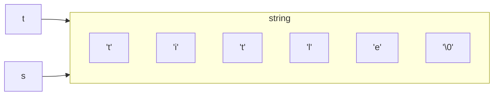
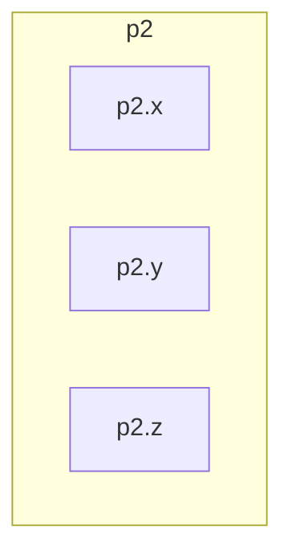
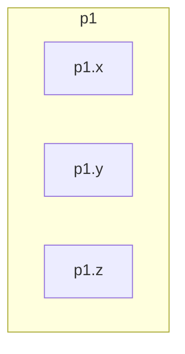

# 翁恺C语言


## 指针入门

> 要不是在学习过程中遇到障碍我也不会尝试用markdown记笔记。　　　　
>
> 主要是因为之前对指针的魅力不了解、学习任务不够紧迫，所以指针的学习困在这里一拖再拖。经常隔一段时间之后再回来就会看不太懂上课的源代码，这极大地增大了我的学习难度。
>
> 显然我需要一个笔记帮助我整理知识点，否则无法把翁恺老师的视频总结出来，也无法把我亲手写的源代码串联。
>
> 源代码就写在markdown的代码块里。
>
> 以后的引用里既有引用别人的成果，也会有我自己的内心独白。

### 取地址运算

#### 初探内存

##### 用`sizeof`函数查看字节数

* `sizeof`既可以看变量的字节数
  * `sizeof(a)`
  * `sizeof(i)`
* `sizeof`又可以直接查看变量类型的字节数
  * `sizeof(int)`
  * `sizeof(double)`

> 如果有洞察力，就可以在这里看出指针的逻辑了：因为类型的字节数固定，所以知道了第一个地址就可以知道整个变量占据了哪些空间。

　　有趣的是，`sizeof`的返回值竟然是长整型，输出的时候要用`%ld`.

```c
#include <stdio.h>
int main()
{
    int a = 6;
    printf("sizeof(int)=%ld\n", sizeof(int));
    printf("sizeof(double)=%ld\n", sizeof(double));
    printf("sizeof(const int)=%ld\n", sizeof(const int));
    printf("sizeof(float)=%ld\n", sizeof(float));
    printf("sizeof(char)=%ld\n", sizeof(char));

    printf("sizeof(a)=%ld\n", sizeof(a));

    return 0;
}
```

```
sizeof(int)=4
sizeof(double)=8
sizeof(const int)=4
sizeof(float)=4
sizeof(char)=1
sizeof(a)=4
```

##### 用运算符&看变量地址

```c
#include <stdio.h>
int main()
{
    int i = 0;
    printf("0x%x\n", &i);//warning:format specifies type 'unsigned int' but the argument has type 'int *' [-Wformat]
    printf("%p\n", &i);
    return 0;
}
```

```
1 warning generated.
0x6fb8f338
0x16fb8f338
```

%p是输出地址，&x是输出16进制整数。

"0x16fb8f338"比"0x6fb8f338"多出1是因为计算机架构的问题。用32位架构就完全相同，我的MacBook Air M1 运行64位的win11虚拟机没问题，所以我的电脑应该不是32位。

###### &只能对变量取地址

&(a++),&(a+b)都是不合法的

###### 用&初窥C语言的"堆栈(stack)"内存分配

```c
#include <stdio.h>
int main()
{
    int i = 0;
    int j;
    printf("&i=%p\n", &i);
    printf("&j=%p\n", &j);
    return 0;
}

```

| 变量 | 地址        |
| ---- | ----------- |
| i    | 0x16fdab318 |
| j    | 0x16fdab314 |

> 这是某一次运行的结果

再运行一次，后三位和前四位都没变，就中间变了

| 变量 | 地址        |
| ---- | ----------- |
| i    | 0x16b95f318 |
| j    | 0x16b95f314 |

这个内存分配模式真有趣，为什么后面的318和314总是不变呢？

多试了几次后发现，如果换成i和p，就变成308和304了，经过这一操作后再换回i和j，还是318和314。看来换了变量名就会有改变，但是我又试了a和j，结果还是318和314。真是猜不透。

总之，C语言的地址分配是自顶向下的，这就是堆栈stack。

###### 数组地址间的关系

```c
#include <stdio.h>
int main()
{
    int a[10];
    printf("%p\n", &a);
    printf("%p\n", a);
    printf("%p\n", &a[0]);
    printf("%p\n", &a[1]);
    return 0;
}
```

```
0x16db57310
0x16db57310
0x16db57310
0x16db57314
```

* 疑惑
  * 最让人费解的是`printf("%p\n", a);`a竟然可以当地址，这里也许“指"的含义可以初见端倪
  * 从stack的性质来看，下标越小，越靠后定义，也就是说最后的a[10]是最先定义的

> 很有道理，如果计算机先从a[0]开始，那么后面每定义一个就得检查一次，而从a[10]开始就可以高枕无忧.


### 指针有什么用

> 这是第二个视频开始的问题，当初听的时候不做笔记就没捕捉到，导致我一直不知道指针的用处，把它当成了学字符串前的无聊的障碍。

就以scanf 为例，传进去地址可以帮我们的函数调用外面的变量。

#### 指针的定义

指针就是保存地址的变量

```cpp
#include <stdio.h>
int main()
{
    int i = 0;
    int *p = &i; // p储存i的地址——p指向i
    int *p1, q1;//p1是指针，q1是整数
    int p2, *q2;//p2是整数，q2是指针
    int* p3, q3;//注意，这里仍然只有p3是指针，因为int*并不是一个类型
    return 0;
}

```

> 此时初学者有一个问题是必须要思考的：鸡从鸡蛋来，鸡蛋从哪来？指针变量需要有其他的容器来存放指针变量的地址吗？
>
> 多看看帖子就明白了，最好再看《C与指针》

作为参数的指针

在函数里面可以通过指针访问外面的变量，可以称作"指向"外面的变量。

```cpp
#include <stdio.h>
void f(int *p)
{
    printf("%p这个地址已经传到函数里面了\n", p);  
}
int main()
{
    int i = 0;
    printf("&i=%p\n", &i);
    f(&i);
    return 0;
}
```

```
&i=0x16f0c3348
0x16f0c3348这个地址已经传到函数里面了
```

##### 简直手眼通天

f函数已经获得了访问外面变量i的能力了，那么何为访问？

* 读
  * 把`*`用作单目运算符，用来求指针变量所指向的变量的值，例如`int k = *p;`则k就得到了i的值
* 写
  * 当`*p = k + 1;`时，i的值就变成了k+1

下面我们目睹一段体现指针实力的代码

```cpp
#include <stdio.h>
void f(int *p)
{
    printf("%p这个地址已经传到函数里面了\n", p);
    printf("因此我可以知道i的值%d,因为*p可以取变量值\n", *p);
    printf("甚至还可以做更邪恶的事情：篡改i的值\n");
    *p += 1;
}
int main()
{
    int i = 0;
    printf("&i=%p\n", &i);
    f(&i);
    printf("被篡改后的i=%d", i);
    return 0;
}

```

```
&i=0x16f32b348
0x16f32b348这个地址已经传到函数里面了
因此我可以知道i的值0,因为*p可以取变量值
甚至还可以做更邪恶的事情：篡改i的值
被篡改后的i=1
```

太邪恶了，我喜欢😍。

> 不过这里有一点不自洽，让我这个物理背景的人不是很能接受。
>
> 我们在定义一个指针变量时 `int *p = &i;`这意味着p是指针变量，p这个变量存储的值是i的地址&i,但是在后面的 `k = *p;`中，`*p`代表i的值，这从数学层面不自洽，很让人嫌弃。
>
> 只能将就着记住 `int *p = &i;`里的 `*`仅仅是一个代表属性的符号。


### 指针与数组

#### 传进函数的 `(int a[])`真的是数组吗

> 翁恺老师一开始用的例子太过复杂，我打算用一个简单的例子来证明传进去的参数不是数组而是指针。

```cpp
#include <stdio.h>
void explore(int a[])
{
    printf("在explore函数里sizeof(a)=%lu\n", sizeof(a));
}
int main()
{
    int a[] = {0, 1, 2, 3, 4, 5, 6, 7, 8, 9};
    printf("在main函数里sizeof(a)=%lu\n", sizeof(a));
    explore(a);
    return 0;
}
```


```
1 warning generated.
在main函数里sizeof(a)=40
在explore函数里sizeof(a)=8
```

```
warning: sizeof on array function parameter will return size of 'int *' instead of 'int []' [-Wsizeof-array-argument]
```

可见传进函数的只有指针，不是整个数组，这是可以理解的，毕竟它有顺序，所以只要一个指针指向外面的其他元素就行了。

> 不过 `sizeof(a)=8`而不是4，可能和架构有关，32位架构下就是4。

* 函数参数表中的数组其实就是指针，以下几种写法都是等价的
  * `int sum(int *ar,int n)`
  * `int sum(int ar,int)`
  * `int sum(int *,int n)`
  * `int sum(int [],int)`

> 怪不得当初自己写函数，想把一个长度为10的数组传进去却失败了，原来是因为我用 `int f(int ar[10])`传进去的只是 `ar[10]`这个值罢了，不是传的整个数组。
>
> 学计算机一定要有主人翁意识，要时刻问自己“如果我想实现这个功能，我会怎么做"，那显然不会把整个数组的所有元素传进去，传一个指针就够了。


#### 数组变量是特殊的指针

* 数组变量本身表达地址

  * `int a[10];int *p=a;`无需使用&
  * `a==&a[0]`
  * 但是从`a[1]`开始的普通数组变量取地址就要用&了

* `*`运算符既可以对指针使用，也可以对数组变量使用；`[]`运算符既可以对数组使用，也可以对指针使用

  * ```cpp
    #include <stdio.h>
    int main()
    {
        int a[] = {22, 3, 5, 2345, 435, 3, 65};
        int *p = a;
        printf("%d\n", p[2]);
        printf("%d\n", *a);//这里只能是*a,连*a[0]都会报错。
        return 0;
    }
    ```

* 数组变量是const的指针，所以不能整体赋值，`int a[]={2,234,567,34};int b[]=a;`就是错的。`int a[];`与 `int * const a=...`是等价的。


##### 一个dalao关于数组变量是特殊的指针的证明

先说结论：数组a和* const p是同一类型的指针。

以下代码报错，说明a和p都不能修改指向的地址。

`int a[5]; int * const p; a++; p++;`

以下代码编译通过，并且输出结果正确，说明可以更改指向的地址所存的内容。

`int a[5]; int * const p = a[0]; a[0] = 0; (*a)++; printf("%p\n", a); printf("%d\n", *a); (*p)++; printf("%p\n", p); printf("%d\n", *p);`

以下代码编译产生两处警告相同，均进行了强制类型转换，运行输出结果相同。

```cpp
int a[5];
int b[5];
int c;
int * const p = &a[0];

c = a;    //[Warning] assignment makes integer from pointer without a cast 
printf("%d\n", c); 
printf("%p\n", c);

c = p;    //[Warning] assignment makes integer from pointer without a cast 
printf("%d\n", c); 
printf("%p\n", c);

```

综上所述，我认为a和* const p是同一类型的指针。

[白l枫](https://www.icourse163.org/learn/ZJU-199001?tid=1465619444#/learn/forumpersonal?uid=1145950085 "白l枫")

2021-12-3

> 原来学技术也可以用学物理的方式啊：根据实验现象提出猜想，再用实验验证。只不过物理研究的是现实世界，CS研究的是信息世界。


## 字符串入门

### 字符类型

#### char具有整数和字符的双重类型

> 先自行探索
>
> Learn ComputerScience with physical methods.

首先，我第一次知道原来char也可以是整数，所以我要验证我的直觉"char类型的数字和字符依靠ASCII码相通"。

```c
#include <stdio.h>
int main()
{
    char c = 33;
    char d = '1';
    printf("%d\n", c);
    printf("%c\n", c);//这里有个有趣的小插曲，是因为我不够了解ASCII导致的：我第一次令c=1,第二次令c=32,都是空的，弄的我以为c的数值不是ascii码。
    printf("%d\n", d);
    //目前为止可以初步证明char类型以ASCII码存在于计算机中
    printf("\101 \x42 C\n");//这是在zgs的课上学到的。
    printf("\101 \102 C\n");
    printf("\101 \x42 \103\n");
    //到这可以初步证明 \ 后面的数字是八进制的，而且与字母对应
    printf("\101 \x41 C\n");//猜多加的x代表16进制
  
    return 0;
}
```

那么我现在的问题是，char是不是也可以是像数组变量那样“自己也能表达地址"？毕竟char的数值与ASCII码一一对应，计算机里应该有固定的区域存储这些字符。

不对！如果由char变量的值就判断出它的地址，那么数值相等的char变量岂不是都放在同一地址！？这不可能。再联想变量，变量值是数字，难道相同数字的变量都放在一个地址嘛？太荒谬了。

##### 整数和字符就是可以相等的

```c
#include <stdio.h>
int main()
{
    if (49 == '1')
    {
        printf("整数和字符就是可以相等的\n");
    }
    return 0;
}
```


```
整数和字符就是可以相等的
```

这体现了ASCII码在计算机内部的普适性。


##### 在scanf中读取char变量不能用%d

`char`和`int`终究是两个类型，不能用%d来读取char字符。

```c
#include <stdio.h>
int main()
{
    char c;
    scanf("%d",&c);
    return 0;
}
```

```
warning:
Format specifies type 'int *' but the argument has type 'char *'
```

实在要读取一个整数再输出ascii码中对应的字符，只能曲线救国——读入一个`int`，然后再赋值给`char`。


#### char类型读取空格的有趣方式

> 翁老师从混合输入出发给我们引入`输入控制流`。

##### `%d %c`与`%d%c`的区别

我们发现加不加空格是有区别的。

如果`%d %c `：

```c
#include <stdio.h>
int main()
{
    char c;
    int i;
    scanf("%d %c",&i,&c);
    printf("i=%d,c=%d,c='%c'",i,c,c);
    return 0;
}
```

```
12 1
i=12,c=49,c='1'
```

```
12a
i=12,c=97,c='a'
```

```
12             a
i=12,c=97,c='a'
```

```
   12    a
i=12,c=97,c='a'
```

```
12
1
i=12,c=49,c='1'
```

```
12


a
i=12,c=97,c='a'
```


一开始乖乖地在数字和字符间输入空格，后来发现空格可以尊重也可以无视。%d和%c之间可以是（多个）空格、（多个）回车。


如果`%d%c`:

```c
#include <stdio.h>
int main()
{
    char c;
    int i;
    scanf("%d%c",&i,&c);
    printf("i=%d\nc=%d\nc='%c'",i,c,c);
    return 0;
}
```

```
12 a
i=12
c=32
c=' '
```

```
12a
i=12
c=97
c='a'
```

```
121
i=121
c=10
c='
'
```

```
12
i=12
c=10
c='
'
```

这里就读得十分紧凑，数字读完了就读字符，所以多打的空格和回车都会被读进来。回车的ASCII码是10，空格是32。

###### `%d %c`中的空格是“负责”符号

没有空格，读完%d就不管后面了，后面随便读到什么，都算%c的。

一旦中间有了空格，那么会一直耐心地等到非空格、非回车的%c出现。

> 我猜根本原因一定是：scanf括号里的格式控制字符串中的空格根本就不是普通的字符。


### 逃逸字符

##### 引起误会，所以逃逸

不会引起误会的字符是大多数，可是当我们想输出带英文双引号的句子时，为了防止在printf里引起误会，所以要用上\

```c
#include <stdio.h>
int main()
{
    printf("I wanna say:\"引起误会，所以逃逸\"");
    return 0;
}
```

\就是声明：不要搞错了嗷，我要用逃逸字符了，不要冤枉和误解！


#### 逃逸字符概览

##### 旧式打字机残留

###### `\b`回退一格

```c
#include <stdio.h>
int main()
{
    printf("123\b456");
    return 0;
}
```

有的编译器把退格执行为删除，例如CLion：

```
12456
```

不过翁恺老师用的两个IDE都没有将其执行为删除，他的编译器是有选择性地删除：如果\b后面是一个非回车空格（翁恺老师只实验了\n）字符，那么就删除前一个再输出我们给的新的。

总之慎用吧。


###### `\t`到下一个表格位

```c
#include <stdio.h>
int main()
{
    printf("RNM\t退钱！");
    return 0;
}
```

```
RNM	退钱！
```

```c
#include <stdio.h>
int main()
{
    printf("RNM\t\t退钱！");
    return 0;
}
```

```c
RNM		退钱！
```

一般来说Tab键是4个空格，但是它不会让你单纯后退4个空格，而是让你对齐下一个位置，又称“制表位”，这里存在一个假想的表格，每格长4个单位长度。你会发现\t就是起到对齐“制表位”的效果。

> 不过我感觉这里好像只有2个单位。

再来几组体会一下：

```c
#include <stdio.h>
int main()
{
    printf("123\t\t456");
    return 0;
}
```

```
123		456
```

```c
#include <stdio.h>
int main()
{
    printf("123\t456");
    return 0;
}
```

```
123	456
```

```c
#include <stdio.h>
int main()
{
    printf("1\t456");
    return 0;
}
```

```
1	456
```

```c
#include <stdio.h>
int main()
{
    printf(".\t1\t.\t.456\t.");
    return 0;
}
```

```
.	1	.	.456	.
```

没错，确实是4个单位，只不过在typora里看上去实在短。

如果一串字符刚好有7个呢？显然，后面只会有1个空格，只要凑整Tab即可。


###### `\n`换行

这已经很熟悉了。


###### `\r`回车

回车和换行有什么区别？

```c
#include <stdio.h>
int main()
{
    printf("\rI wanna say:\"引起误会，所以逃逸\"");
    return 0;
}
```

```
I wanna say:"引起误会，所以逃逸"
```

放在开头没有任何改变。

```c
#include <stdio.h>
int main()
{
    printf("I wanna say:\"引起误会，所以逃逸\"\r");
    return 0;
}
```

放在结尾也没有作用。

```c
#include <stdio.h>
int main()
{
    printf("I wan\rna say:\"引起误会，所以逃逸\"");
    return 0;
}
```

```
na say:"引起误会，所以逃逸"
```

放在中间，把前面的弄没了。那为什么放在最后不会把整个句子弄没呢？

```c
#include <stdio.h>
int main()
{
    printf("I wann\ra say:\"引起误会，所\r以逃逸\"\r");
    return 0;
}
```

多加几个，发现只执行最右边的(默认最最右边的不执行)：

```
以逃逸"
```


##### 现代误会

`\'` `\"` `\\`可以用来打出' " \


### 字符串

#### 字符数组与字符串

`char word[]={'H','e','l','l','!',o'};`是字符数组，不是字符串，它不能做字符串的计算。

> 目前不知道字符串能做什么计算、为什么要做计算，感觉这是搞明白字符串存在的意义的突破口。

`char word[]={'H','e','l','l','o','!','\0'};`是字符串。

* 字符串是以0结尾的一串字符

  * 0就是'\0'，和'0'完全不一样

    > 翁恺：“0可以是int类型、long int类型，占的字节数不一定相同，但是'\0'就是只占一个字节。”
    >
    > 我很困惑，'\0'到底是什么？我纠结的是它的数据类型，计算机里不搞清楚数据类型怎么行呢？
    >
    > * 它外面有单引号，应该是字符
    > * 但是又说0就是'\0'
    >
    > 查了ASCII码就明白了，'\0'的ASCII码值就是0。

* 0标志字符串的结束，但是它不是字符串的一部分

  > 这里翁恺前后矛盾了，前面他说，`char word[]={'H','e','l','l','o','!','\0'};`有七个元素，显然把0算进去了。这里又说不是字符串的一部分，计算长度的时候不算它。
  >
  > 难道说字符数组和字符串有差别？字符数组的长度比字符串多1？

* 字符串以数组的形式存在，可以通过数组或指针访问

  * 多用指针访问

* <string.h>里面有很多字符串的函数


#### 字符串变量和字符串常量

##### 字符串变量

以下的定义都是对的：

* 用指针定义
  * `char *str="Hello"`
* 用数组定义
  * `char word[]="Hello"`
  * `char line[10]="Hello"`

编译器都会在存储的时候在末尾加上'\0'表示结束。

> 感觉这里初步体现出字符串和字符数组的区别。字符串真的可以如此轻松地定义，不像数组定义还要打括号和一堆单引号。


##### 字符串常量

* `"Hello"`这个字符串常量会被编译器以字符数组的形式存储，长度为6
* 两个相邻的字符串常量会被自动连接起来

```c
#include <stdio.h>
int main()
{
    //一个貌似错误的程序
    printf("两个相邻的字符串常量""会被自动连接起来!");
    return 0;
}
```

你会发现即使两组引号之间没有逗号也没关系。

还可以用\来告诉计算机字符串没有结束：

```c
#include <stdio.h>
int main()
{
    printf("两个相邻的字符串常量\会被自动连接起来!");
    return 0;
}
```


在CLion里，加了逗号反而只能输出前半部分：

```c
#include <stdio.h>
int main()
{
    //一个貌似正确的程序
    printf("两个相邻的字符串常量","会被自动连接起来!");
    return 0;
}
```

```
warning:
Data argument not used by format string
```


### 字符串变量

#### 字符串输入输出

##### 字符串的*赋值*仅仅是指针操作

```c
#include <stdio.h>
int main()
{
    char *t="title";
    char *s;
    s=t;
    return 0;
}
```

调试后发现，`s=t;`的作用是让地址s等于地址t，这样s和t就指向了同一个字符串。

> 这在逻辑上也是自洽的，`s`和`t`本就是指针变量，`s=t;`不可能生成新字符串。

但是s没有生成一个新的字符串，生成新的字符串需要字符串函数。



##### 用`%s`搭配`scanf`和`printf`输入输出

我们关注的是读到什么时候为止

* 空格？
  * ASCII=32
* 空字符？
  * ASCII=0

这是两个不同的字符。

```c
#include <stdio.h>
int main()
{
    char word[8];
    scanf("%s",word);
    printf("%s##",word);
    return 0;
}
```

读到空格就不读了：

`Hello World!`
`Hello##`

```c
#include <stdio.h>
int main()
{
    char word[8];
    scanf("%s",word);
    word[4]=32;
    printf("%s##",word);
    return 0;
}
```

```
asdasd
asda d##
```

```c
#include <stdio.h>
int main()
{
    char word[8];
    scanf("%s",word);
    word[4]=0;
    printf("%s##",word);
    return 0;
}
```

```
asfdasf
asfd##
```

我让`word[4]`成为空格，后面的正常输入。说明空格*告诉*`scanf`不要再读了，但是`scanf`能分清空格和空字符。空格、回车和tab都能起到*告诉*的作用。

###### 用`%s`搭配`scanf`输入是不安全的

因为不知道读入的长度会不会超过字符串的最大长度。

```c
#include <stdio.h>
int main()
{
    char word[8];
    scanf("%s",word);
    printf("%s##",word);
    return 0;
}
```

```
12345678

```

尝试多次后发现，长度≥8时，无法输出。调试的时候看见这个信息：`SIGABRT (signal SIGABRT)`，意识就是越界了。

###### 补救措施：`%+number+s`

```c
#include <stdio.h>
int main()
{
    char word1[8];
    char word2[8];
    scanf("%7s",word1);
    scanf("%7s",word2);
    printf("%s##%s##",word1,word2);
    return 0;
}
```

```
12345678
1234567##8##
```

输入`12345678`之后按了一次回车就结束了。

于是我们完成了一次修补，用`%+number+s`搭配`scanf`可以用了


##### 字符指针≠字符串

定义了一个字符指针，只是获得了一个地址，至于指向哪里，纯靠运气。

```c
#include <stdio.h>
int main()
{
    char *string;
    scanf("%s",string);
    return 0;
}
```

Warning:

```
Variable 'string' is uninitialized when used here
```

需要初始化，否则就真的靠运气了。

不过我的CLion比较牛，不管我输入什么字符串都输出一行空的。

```
qw

```

```
1346473457356

```

不过，奇怪的是，即使我已经初始化了，还是输出空行：

```c
#include <stdio.h>
int main()
{
    char *string;
    string="aafaqqa";
    scanf("%s",string);
    printf("%s",string);
    return 0;
}
```

```
qwefqqe

```

这样的初始化也不行：

```c
#include <stdio.h>
int main()
{
    char *string="hahaha";
    scanf("%s",string);
    printf("%s",string);
    return 0;
}
```

看来是真的不能用字符指针。


##### 空字符串

```c
#include <stdio.h>
int main()
{
    char string[100]="";
    printf("%s",string);
    return 0;
}
```

`char string[100]="";`创造了一个空字符串,`string[0]='\0'`。

我们检验是不是除了`string[0]`以外的其他元素都空or没被赋值。

```c
#include <stdio.h>
int main()
{
    char string[100]="";
    int i;
    for (i=0;i<5;i++) {
        printf("string[%d]=%s\n",i,string[i]);
    }
    return 0;
}
```

```
string[0]=(null)
string[1]=(null)
string[2]=(null)
string[3]=(null)
string[4]=(null)

```

其实还有一则warning：

```
Format specifies type 'char *' but the argument has type 'char'
```


`(null)`可能是CLion提供的很贴心的写法，我们直接看ASCII码：

```c
#include <stdio.h>
int main()
{
    char string[100]="";
    int i;
    for (i=0;i<5;i++) {
        printf("string[%d]=%d\n",i,string[i]);
    }
    return 0;
}
```

```
string[0]=0
string[1]=0
string[2]=0
string[3]=0
string[4]=0

```

全是0，这就是空字符串。`string[100]`这个空字符串里面有100个`'\0'`字符。

* 第一个是空字符
* 后面的也不是乱赋值，也都变成了空字符


形成对比的是，如果不声明字符串的长度，如`char string[]="";`，那么计算机会让这个字符串的长度为1，即只有一个空字符，大概率是为了节约存储空间。


#### 字符串函数

要用的头文件`<string.h>`

##### `strlen`

```c
#include <stdio.h>
#include <string.h>
int main()
{
    char line[]="Hello";
    printf("strlen(line)=%ld\n", strlen(line));
    printf("sizeof(line)=%ld", sizeof(line));
    return 0;
}
```

```
strlen(line)=5
sizeof(line)=6
```

注意到`%lu`和`%ld`都可以。


##### `strcmp`

我们想比较两个字符串是否相等，可惜`if(s1==s2) {...}`这个功能是没有的，因为他们本质上都是数组，地址是不一样的，所以`s1==s2`始终返回0。

因祸得福的是，我们有一个更强大的函数，不光能判断两个字符串是否相等，还能比较大小。

> ~~至于*比较大小*的规则，我觉得是比较字符串所有元素ASCII码之和。~~

```c
#include <stdio.h>
#include <string.h>
int main()
{
    char s1[100];
    char s2[100];//确保充足的长度。
    scanf("%s",s1);
    scanf("%s",s2);
    printf("%d", strcmp(s1,s2));
    return 0;
}
```

我们按照控制变量法来研究，先研究字符串相同的情况。

```
abc
abc
0
```

```
1234567
1234567
0
```

```
O。o___^~^
O。o___^~^
0
```

可见两个字符串完全相同时函数返回值为0。

然后再长度相同的情况下，改变一个字符：

```
abc
bbc
-1
```

a的ASCII码值比b少1。

```
abc
abd
-1
```

```
113
123
-1
```

```
213
113
1
```

```
333
133
2
```

到这里还是非常符合直觉的：整个字符串ASCII码之和的差值就是`strcmp`函数的值。

但是下面就有点可怕了：

```
333
111
2
```

```
333
113
2
```

```
444
111
3
```

```
444
113
3
```

似乎只和第一个元素之差有关。甚至当我改变元素个数：

```
444
111111
3
```

```
4
1113
3
```

```
ad
fffff
-5
```

初步猜测，当两个字符串内容不同时，`strcmp`的值就是两个字符串首个元素的ASCII码差值，后面的其他元素就不去管了。

如果第一个字符相同呢，就顺次比较后面的：

```
C#
C++
-8
```

'#'=35,'+'=43——所以-8是第二顺位之差

当计算机把每一位都比较完之后，如果都相等，那么`strcmp`就是0了。

如果前几项一直都相同，但是最后有一个字符串多处来几项：

```
rnm
rnmtuiqian
-116
```

为了验证116是不是tuiqian的ASCII之和，我亲自验算：

> 1a	2b	3c	4d	5e	6f	7g	8h	9i	10j	11k	12l	13m	14n	15o	16p	17q	18r	19s	20t	21u	22v	23w	24x	25y	26z	
>
> tuiqian=96+(20+21+9+17+9+1+14)≠116
>
> 但容易看出116=96+20，没错，就是t的ASCII码值！所以计算机还是像我预料的一样喜欢省力。

也就是说，最后幺如果出蛾子，也只用管第一个幺蛾子。

可以理解成第一个幺蛾子元素和'\0'之差，就是它自身。

是否可以用一个程序优雅地、系统地证明、展示我的推理？

```c
#include <stdio.h>
#include <string.h>
int main()
{
    char s1[101];
    char s2[101];//确保充足的长度。
    printf("我推理出strcmp函数的原理了：\n从第一个元素开始逐一比对，一旦出现不同就计算第一组异项的ASCII码之差，作为strcmp函数的返回值。\n");
    printf("please input 2 strings(length≤100):\n");
    scanf("%s",s1);
    scanf("%s",s2);
    printf("strcmp(s1,s2)=%d\n", strcmp(s1,s2));
    printf("下面让我们细致分析:\n");
    int i=0;
    while (s1[i]==s2[i]) {
        printf("%c和%c相同，s1[%d]-s2[%d]=0\n",s1[i],s2[i],i,i);
        i++;
    }
    printf("\n终于出现一个不一样的了！s1[%d]-s2[%d]=%d-%d=%d,恰好就是strcmp(s1,s2)的值%d,说明计算机发现一个不一样的就停止了",i,i,s1[i],s2[i],s1[i]-s2[i],strcmp(s1,s2));
    return 0;
}
```


##### `strcpy`

```c
#include <stdio.h>
#include <string.h>
int main()
{
    char s1[101];
    char s2[101];//确保充足的长度。
    printf("please input 2 strings(length≤100):\n");
    scanf("%s",s1);
    scanf("%s",s2);
    printf("strcpy(s1,s2)根本就不是copy and paste,而是残忍的替换：\n");
    strcpy(s1,s2);
    printf("s1=%s,已经被替换成s2了。",s1);
    return 0;
}
```


```
please input 2 strings(length≤100):
苏维埃社会主义
苏修叛徒集团+社会帝国主义
strcpy(s1,s2)根本就不是copy and paste,而是残忍的替换：
s1=苏修叛徒集团+社会帝国主义,已经被替换成s2了。
```

有趣的事，即使s1更短也能被强行替换成s2，不用担心什么越界的问题。——毕竟'\0'也是一个元素，是可以被替换的，只要定义时给出的存储空间够用就行了。

那么如果真的连存储空间都不够呢？是否还能替换？比如我们用上`char s1[]="0";`这样s1的长度就只有1。

```c
#include <stdio.h>
#include <string.h>
int main()
{
    char s1[]="0";
    char s2[101];//确保充足的长度。
    printf("please input s2(length≤100):\n");
    //scanf("%s",s1);
    scanf("%s",s2);
    printf("strcpy(s1,s2)根本就不是copy and paste,而是残忍的替换：\n");
    strcpy(s1,s2);
    printf("s1=%s,已经被替换成s2了。",s1);
    return 0;
}
```

```
1324125
strcpy(s1,s2)根本就不是copy and paste,而是残忍的替换：

```

果然爆掉了💩。甚至都无法执行最后一行输出语句。

> 突然发现翁恺老师后面就立刻讲到这个问题了！这就叫*不安全*。


##### `strcat`

cat代表连接，不是猫🐱！

`strcat(s1,s2)`让`s1`从`s1[strlen(s1)]`开始(本来是'\0'的)接上`s2`。

```c
#include <stdio.h>
#include <string.h>
int main()
{
    char s1[101];
    char s2[101];//确保充足的长度。
    printf("please input 2 strings(length≤100):\n");
    scanf("%s",s1);
    scanf("%s",s2);
    strcat(s1,s2);
    printf("strcat(s1,s2)后,s1=\"%s\"",s1);
    return 0;
}
```

```
RNM!
TuiQian!
strcat(s1,s2)后,s1="RNM!TuiQian!"
```

> `strcmp`和`strcat`都是可以自己写出来的。
>
> `strcmp`和`strcat`都是不安全的。（这两点共同点没有因果联系）


安全的版本：

* `strncat(s1,s2,n)`把s2前n位接到s1后面

```c
#include <stdio.h>
#include <string.h>
int main()
{
    char s1[101];
    char s2[101];//确保充足的长度。
    printf("please input 2 strings(length≤100):\n");
    scanf("%s",s1);
    scanf("%s",s2);
    strncat(s1,s2,3);
    printf("strcat(s1,s2,3)后,s1=\"%s\"",s1);
    return 0;
}
```

```
1234
23452346
strcat(s1,s2,3)后,s1="1234234"
```


* `strncpy(s1,s2,n)`把s2前n位覆盖到s1

```c
#include <stdio.h>
#include <string.h>
int main()
{
    char s1[101];
    char s2[101];//确保充足的长度。
    printf("please input 2 strings(length≤100):\n");
    scanf("%s",s1);
    scanf("%s",s2);
    strncpy(s1,s2,3);
    printf("strcpy(s1,s2,3)后,s1=\"%s\"",s1);
    return 0;
}
```

```
125345246
55555
strcpy(s1,s2,3)后,s1="555345246"
```

出乎意料！看来`strncpy`起到的作用是把s2的前n位覆盖到s1的前n位


`strcmp`也有对应的`strncmp(s1,s2,n)`，是比较前n位。这并不是为了安全。


## 结构类型

### 枚举

#### 为什么需要枚举？

1. 数字常量化的需求
   1. 用常量变量代替数字，增加程序可读性
2. `const int`比较麻烦

```c
#include <stdio.h>
int main()
{
    int color;
    char *favor=NULL;
    scanf("%d",&color);
    const int RED=1;
    const int GREEN=2;
    const int BLUE=3;
    switch (color) {
        case RED:
            favor="red";
            break;
        case GREEN:
            favor="green";
            break;
        case BLUE:
            favor="blue";
            break;
        default:
            favor="unknown";
    }
    printf("you favorite color is %s",favor);
    return 0;
}
```

```
2
you favorite color is green
```

当然`const int`的定义可以放在`main`外面。当然也可以用`#define`。

```c
#include <stdio.h>
#define RED 1
#define GREEN 2
#define BLUE 3
int main()
```

#### 枚举的定义规则

用枚举定义就方便很多

```c
#include <stdio.h>
enum COLOR {RED,GREEN,BLUE};//这是一个语句
int main()
{
    int color;
    char *favor=NULL;
    scanf("%d",&color);
    switch (color) {
        case RED:
            favor="red";
            break;
        case GREEN:
            favor="green";
            break;
        case BLUE:
            favor="blue";
            break;
        default:
            favor="unknown";
    }
    printf("you favorite color is %s",favor);
    return 0;
}
```

```
2
you favorite color is blue
```

`enum {RED,GREEN,BLUE};`也是可以的，毕竟那个COLOR只是一个标识作用。

##### 小技巧：计算长度

枚举是默认从0开始赋值,和数组很像。

`enum COLOR {RED,YELLOW,GREEN,NumberColors}`，那么NumberColors的值就是它前面的常量(我们关心的颜色)的个数。

##### 不常规的定义

也可以人为赋值

```c
enum {RED,GREEN=66,BLUE=99};
```

但是枚举赋值不能相同！这是一个缺点！

```c
enum {RED,GREEN=66,BLUE=0};
```

```c
error:
Duplicate case value: 'RED' and 'BLUE' both equal '0'
```

与其说这是缺点，不如说这个功能不为重复赋值而生。每个常量都要有所区分，才能起到一一对应的作用。

此外，枚举赋值可以不递增，例如我可以让BLUE小于GREEN：

```c
enum {RED,GREEN=66,BLUE=2};
```

#### 枚举到底是什么类型？

```c
enum COLOR {RED,GREEN,BLUE};
```

其中的COLOR，前面说可要可不要，但是最好还是要有的，因为enum可以产生一个新的、属于我自己的数据类型COLOR，这很有趣。

在函数里声明的时候也是把COLOR当一个新的数据类型(当然还是以int存储)，但是在C语言里面要和前面的enum一起用：

```c
#include <stdio.h>
enum COLOR {RED,GREEN,BLUE,PURPLE,YELLOW,C20H19N3,};//这是一个语句
void f(enum COLOR t,int n);
int main()
{
    enum COLOR c=RED;//这就是定义
    int n;
    scanf("%d",&n);
    f(c,n);
    return 0;
}
void f(enum COLOR t,int n)
{
    printf("RED后的第%d个颜色值是%d",n,t+n);
}

```

```
3
RED后的第3个颜色值是3
```

有点尴尬的是，本来想输出`RED后的第3个颜色是PURPLE`的，但是发现并不能返回常量名，可见其和数组的区别。

#### 枚举的好处总结

* 虽然枚举可以当成一个新的类型，但并不好用
* 排比定义比`const int `方便，比`#define`好用
  * 比`const int`也仅仅好在默认从0开始定义
    * 因为`const int`如果用逗号隔开各个常量，在一行里定义，其实也不烦
  * 比`#define`好在，我们知道我们得到的是int类型


### 结构

#### 结构类型

> 说白了就是表格里的属性嘛。

```c
#include <stdio.h>
int main()
{
    struct date {
        int month;
        int day;
        int year;
    };//CLion自动帮我补奇了分号
    struct date today;//定义了一个结构类型的变量today，它的内容丰富
    today.month=5;
    today.day=27;
    today.year=2022;
    printf("The date of today is %d-%d-%d in American date form",today.month,today.day,today.year);
    return 0;
}
```

```
The date of today is 5-27-2022 in American date form
```

这是结构类型的定义，可以放在函数里面，只为这个函数所用——但是我们更喜欢放在外面，能为所有函数所用。

当然，分号始终不能丢，因为这只是一个定义的语句，大括号不是变量空间。

最后输出的时候，翁恺老师用的是`%i`，这也是输出整型，不过是老式写法。

> [C语言中输入输出所有格式控制符 | Tom's develop Blog (tomsworkspace.github.io)](https://tomsworkspace.github.io/2020/01/16/C语言中输入输出所有格式控制符/)

##### 声明结构的三种方式

除了一开始我们使用的方式，还有两种比较简陋的版本。

```c
struct point{
        int x;
        int y;
    }p1,p2;
```

这种省略了后期再多打`struct point`来定义结构变量。

还有一种，我们甚至不关注结构的名字：

```c
struct {
        int x;
        int y;
    }p1,p2;
```

##### 每一个结构里的变量是如何存储的？

我感觉结构的存储和数组有相似之处。

```c
#include <stdio.h>
int main()
{
    struct t{
        int x;
        int y;
        int z;
    }p1,p2;
    printf("%p-->p1.x\t%p-->p1.y\t%p-->p1.z\n%p-->p2.x\t%p-->p2.y\t%p-->p2.z\n",p1.x,p1.y,p1.z,p2.x,p2.y,p2.z);
    return 0;
}
```

```
0x9-->p1.x	0x0-->p1.y	0x9055060-->p1.z
0x59336d0-->p2.x	0x3-->p2.y	0x100d68883-->p2.z
```

```
0x9-->p1.x	0x0-->p1.y	0x8c0c060-->p1.z
0x4ffc6d0-->p2.x	0x3-->p2.y	0x10087a883-->p2.z
```

```
0x9-->p1.x	0x0-->p1.y	0xa845060-->p1.z
0x87856d0-->p2.x	0x3-->p2.y	0x1023ca883-->p2.z
```

好奇怪啊！这个地址真是诡异。

诶，低级错误，天呐。竟然忘记加`&`了。

```
0x30c6f06c0-->p1.x	0x30c6f06c4-->p1.y	0x30c6f06c8-->p1.z
0x30c6f06b0-->p2.x	0x30c6f06b4-->p2.y	0x30c6f06b8-->p2.z
```

```
0x30d9d26c0-->p1.x	0x30d9d26c4-->p1.y	0x30d9d26c8-->p1.z
0x30d9d26b0-->p2.x	0x30d9d26b4-->p2.y	0x30d9d26b8-->p2.z
```

不难总结出





发现：

* p1 先定义，被压在堆栈下面，奇怪的是x也先定义，却被放在了上面！

* p1内部、p2内部地址间隔4，p2.z和p1.x隔了8

  * 有没有可能中间隔了p1或p2的地址？

    * 检验

    ```
    0x30dc346c0-->p1.x	0x30dc346c4-->p1.y	0x30dc346c8-->p1.z
    0x30dc346b0-->p2.x	0x30dc346b4-->p2.y	0x30dc346b8-->p2.z
    0x30dc346c0-->p1	0x30dc346b0-->p2
    ```

    发现中间隔的并不是p1或p2，而且`&p1==&p1.x`,`&p2==&p2.x`


##### 结构初始化

```c
#include <stdio.h>
int main()
{
    struct t{
        int x;
        int y;
        int z;
    };
    struct t p1={1,2,3};
    struct t p2={.x=666,.z=9};
    return 0;
}
```

`struct t p1={1,2,3};`是依次初始化；`struct t p2={.x=666,.z=9};`是只初始化了p2.x和p2.z，p2.y默认初始化为0，这点和数组很像的。

###### 简陋定义下的初始化

之前提到有两种简陋定义，他们怎么初始化呢？

* 错误做法

  * 亡羊补牢

    * ```c
      struct t{
              int x;
              int y;
              int z;
          }p1,p2;
          p1={1,2,3};
      ```

    * ```
      error:
      Expected expression
      ```

    * 总之，这已经不是初始化了，这是一种不合法的后期赋值

  * 重复定义

    * ```c
      struct t{
              int x;
              int y;
              int z;
          }p1,p2;
          struct t p1={1,2,3};
      ```

    * ```
      error:
      Redefinition of 'p1'
      ```

    * 这是重复定义，不合法

* 正确做法

  * ```c
    struct t{
            int x;
            int y;
            int z;
        }p1={1,2,3},p2;
    ```

  * 在简陋定义的时候就初始化


###### 和数组的相似处

* 定义时若只初始化一个元素，那么其他的元素都默认初始化为0

  * ```c
    #include <stdio.h>
    #define N 5
    int main()
    {
        struct t{
            int x;
            int y;
            int z;
        }p1={114514},p2;
        printf("p1.x=%d\tp1.y=%d\tp1.z=%d\n",p1.x,p1.y,p1.z);
        int a[N]={1919810},i;
        for (i=0;i<N;i++) {
            printf("a[%d]=%d\t",i,a[i]);
        }
        return 0;
    }
    ```

  * ```
    p1.x=114514	p1.y=0	p1.z=0
    a[0]=1919810	a[1]=0	a[2]=0	a[3]=0	a[4]=0	
    ```

* 定义时若没做任何初始化，那么元素里的值就是随机的，就像开盲盒

  * ```c
    #include <stdio.h>
    #define N 5
    int main()
    {
        struct t{
            int x;
            int y;
            int z;
        }p1,p2;
        printf("p1.x=%d\tp1.y=%d\tp1.z=%d\n",p1.x,p1.y,p1.z);
        int a[N],i;
        for (i=0;i<N;i++) {
            printf("a[%d]=%d\t",i,a[i]);
        }
        return 0;
    }
    ```

  * ```
    p1.x=77410000	p1.y=1	p1.z=81412112
    a[0]=226223824	a[1]=3	a[2]=81012867	a[3]=2	a[4]=9	
    ```


